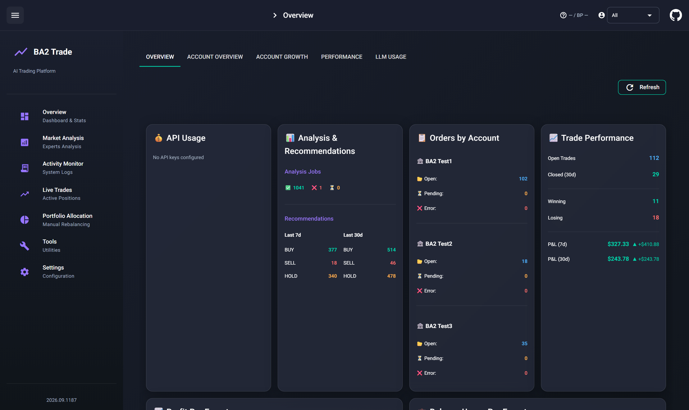
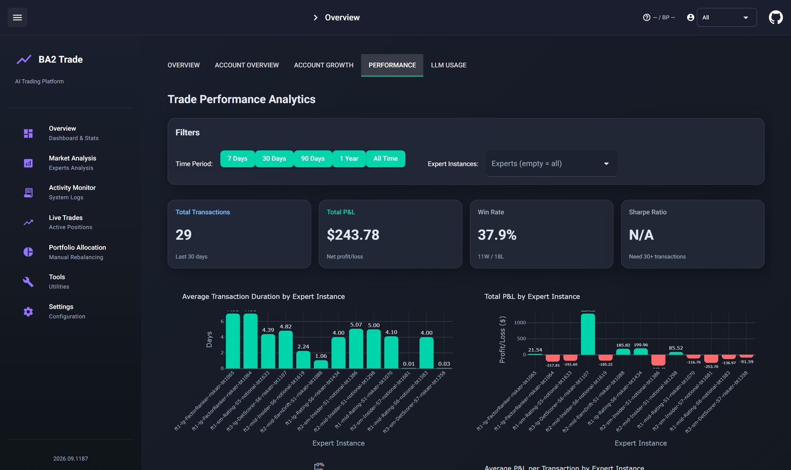
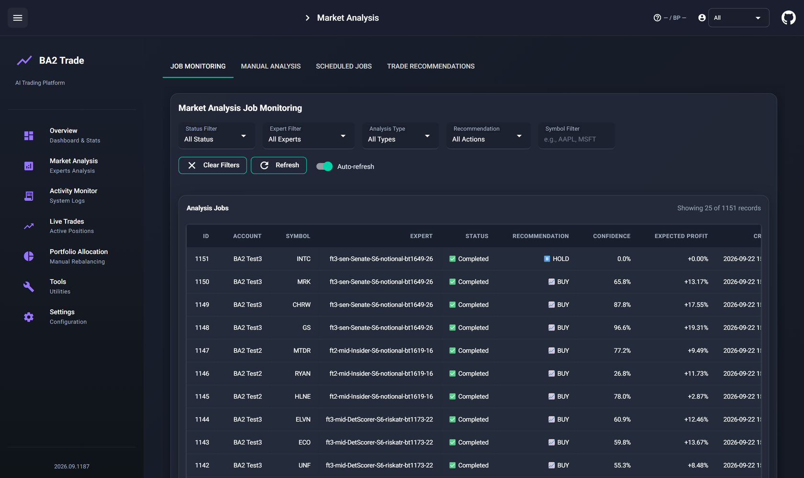
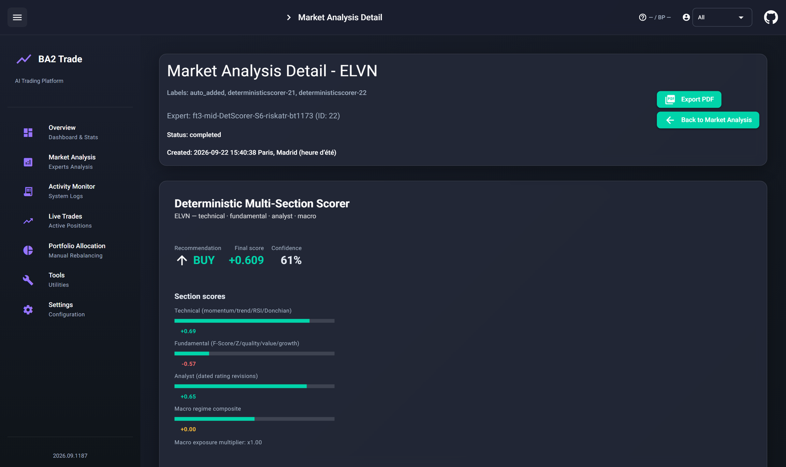
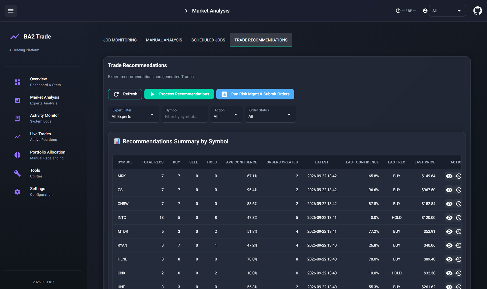
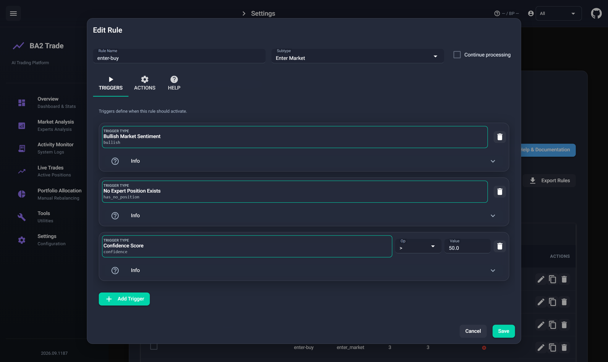
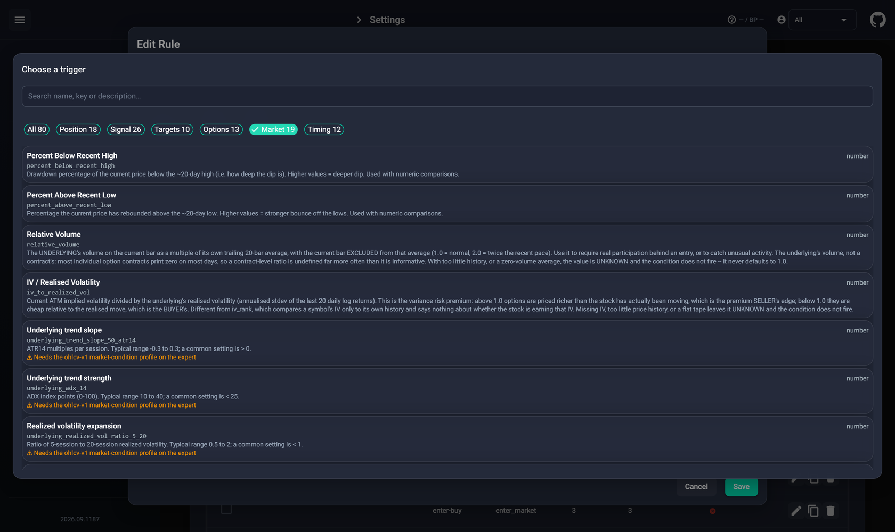
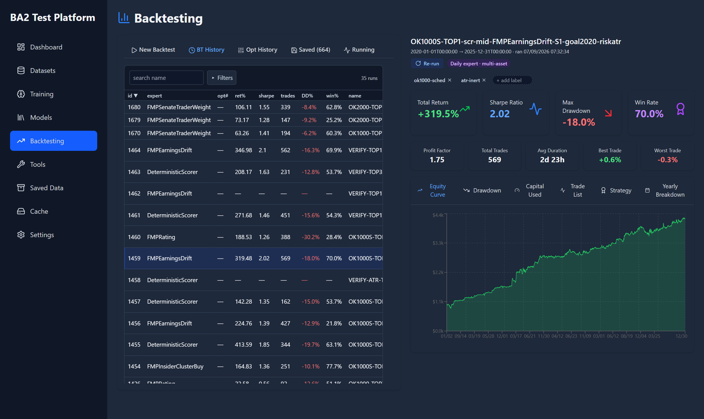

# BA2 Trade Platform

A self-contained Python monorepo for algorithmic trading, shipping **two applications** over three shared installable packages (`ba2_common` / `ba2_providers` / `ba2_experts`):

- **ba2-trade** (repo root) — the live trader: a NiceGUI web app that runs a fleet of market experts against broker accounts (Alpaca for equities and options, TastyTrade for equities), with ruleset-driven trade actions, classic or AI risk management, order execution, manual portfolio allocation and performance analytics.
- **ba2-test** (`testplatform/`) — the backtesting & optimization platform: a FastAPI + React app that backtests the experts day by day, searches their settings, rulesets and exits with a genetic algorithm (optionally across remote workers), stress-tests the winners and hands them to the live platform. It also carries a deep-learning forecasting module. See [testplatform/README.md](testplatform/README.md).

Both apps run the *same* expert/provider code, which is what makes a backtest predictive of live behaviour.

## 📸 Screenshots

### Dashboard
Analysis jobs, recommendations, orders per account and trade performance at a glance.



### Performance analytics
P&L, win rate and per-expert breakdowns over a chosen period.



### Market analysis jobs
Every expert run per symbol, with its status, recommendation, confidence and expected profit.



### Analysis detail
What an expert saw and why it decided: here the Deterministic Multi-Section Scorer's section
scores behind a BUY.



### Trade recommendations
Recommendations summarised by symbol, with the orders they produced; process them and run the
risk manager from here.



### Rules
Rules combine triggers (conditions) with actions; rulesets order them per expert.



### Trigger picker
Triggers are grouped by category (position, signal, targets, options, market, timing) and
searchable. Market-condition triggers say which profile the expert needs to use them.



### Backtesting platform
The backtesting and GA-optimization platform; see the
[test platform README](testplatform/README.md) for more screenshots.



## 🚧 ALPHA SOFTWARE - UNSTABLE

**⚠️ THIS PROJECT IS CURRENTLY IN ALPHA STAGE AND CONSIDERED UNSTABLE ⚠️**

- 🧪 **Experimental Release**: This is pre-beta software with active development and breaking changes
- 🔄 **Frequent Updates**: APIs, database schema, and core functionality may change without notice
- 🐛 **Expect Bugs**: Known and unknown issues exist throughout the platform
- 📝 **Incomplete Features**: Some functionality may be partially implemented or missing
- 🔧 **Developer Focused**: Currently intended for developers and advanced users willing to troubleshoot
- 💾 **No Migration Guarantees**: Database schema changes may require fresh installations
- 📋 **Documentation Gaps**: Some features may lack complete documentation

**USE ONLY FOR TESTING AND DEVELOPMENT - NOT SUITABLE FOR PRODUCTION TRADING**

## ⚠️ IMPORTANT DISCLAIMER

**THIS SOFTWARE IS PROVIDED "AS-IS" WITHOUT WARRANTY OF ANY KIND.**

- 🚨 **Trading involves substantial risk of loss** and is not suitable for all investors
- 🧪 **This software is experimental** and should be thoroughly tested in paper trading mode before considering live trading
- 💰 **You can lose money** - possibly all of your investment capital
- 🤖 **AI-driven decisions are not infallible** - algorithms can make mistakes, markets are unpredictable
- 📉 **Past performance does not guarantee future results** - backtesting and historical analysis may not reflect real trading conditions
- ⚙️ **Software bugs may exist** - thoroughly review all code and test extensively before use
- 🔒 **Use at your own risk and discretion** - you are solely responsible for any trading decisions and their outcomes
- 💼 **Not financial advice** - this platform is a tool for educational and research purposes

**RECOMMENDED PRACTICES:**
- ✅ Start with paper trading to familiarize yourself with the platform
- ✅ Set strict risk limits and position sizing rules
- ✅ Monitor all automated trades closely
- ✅ Never invest more than you can afford to lose
- ✅ Understand the underlying strategies and code before enabling automation
- ✅ Keep detailed logs and review trading decisions regularly
- ✅ Test thoroughly in various market conditions before live deployment

By using this software, you acknowledge that you understand and accept these risks.

## 🚀 Features

### Core Platform
- **Plugin Architecture**: brokers implement `AccountInterface` (plus `OptionsAccountInterface` for
  options), experts implement `MarketExpertInterface`; both declare their settings through
  `ExtendableSettingsInterface` and are configured from the web UI
- **Shared package split** (see the intro): `ba2_common` holds models/DB/interfaces/types/position
  sizing/rule evaluation, `ba2_providers` the market-data providers, screener and caches, `ba2_experts`
  the expert implementations — so an expert is written once and runs identically live and in backtest.
- **SQLModel ORM**: SQLite backend with Alembic migrations (`migrate.py`)
- **NiceGUI Web Interface**: configuration and monitoring UI, with a responsive layout for phones
- **Scheduling & Parallelism**: `JobManager` (APScheduler) runs weekly or monthly expert schedules;
  `WorkerQueue` analyses symbols in parallel and persists queued tasks so they resume after a restart
- **Instrument Selection**: static lists, AI-selected, expert-selected, or a configurable stock
  screener ([EXPERTS.md](EXPERTS.md#instrument-selection-methods))
- **Centralized Logging**: rotating app/debug/error logs plus one log file per expert instance

### Rules & Trade Automation
- **Rulesets**: each expert instance links an *enter-market* ruleset and an *open-positions* ruleset.
  A rule (`EventAction`) pairs trigger conditions with actions; `TradeActionEvaluator` evaluates the
  ruleset's rules in order against each new recommendation or open position
- **Actions**: buy, sell, close, adjust take-profit / stop-loss, increase / decrease instrument share,
  stop processing, and the option actions listed below
- **Trigger picker**: the rule editor groups triggers into position, signal, targets, options, market
  and timing categories; the **Ruleset Test** page evaluates a ruleset without trading
- **Market-condition gates**: set an expert's `market_condition_profile` (`ohlcv-v1`,
  `ta-structure-v1`) and its rules can gate on that profile's fields, numerically or categorically.
  A rule using a market field while the expert serves no profile is refused at save/import
- **Import/Export**: rules, rulesets and expert settings (single expert or batch)
- **Semi-automatic or automatic**: an expert only opens or modifies positions by itself when
  `allow_automated_trade_opening` / `allow_automated_trade_modification` are enabled (both default
  to off); otherwise recommendations are processed from the UI

### Options Trading
- **Option actions**: long call / put, bull and bear call / put spreads, covered call, protective put,
  cash-secured put, long and short straddle / strangle, iron condor, jade lizard, call butterfly, put
  ratio spread, call / put backspread, poor man's covered call (open and roll), close option
- **Entry-option path**: a ruleset can open an option structure with no equity leg
- **Broker**: Alpaca implements `OptionsAccountInterface`; the Live Trades page has an **Options** tab
  with structure detail and a payoff chart
- **Option risk rails**: `risk_manager_mode: classic_options` gates every option entry with sleeve
  rails (max deployment, notional leverage, undefined-risk cap, max concurrent structures,
  one-per-underlying, assignment capacity) and a drawdown circuit breaker, identically in live and in
  backtests
- **Historical option data** for backtests: Alpaca, ThetaData (requires a locally running Theta
  Terminal) and TastyTrade providers; historical implied volatility / greeks are computed with
  Black-Scholes

### Risk Management & Position Sizing
- **Classic risk manager** (`risk_manager_mode: classic`, the default): ranks and sizes
  recommendations using the expert's rules and sizing settings; every run is recorded (ranking inputs,
  capital mapping, per-order sizing) and shown in the UI
- **Smart Risk Manager** (`smart`): a LangGraph agent that manages the expert's portfolio with the
  configured `risk_manager_model`; each job has a detail page
- **Virtual Equity**: each expert instance works with a `virtual_equity_pct` share of the account,
  with per-instrument caps (`max_virtual_equity_per_instrument_percent`)
- **Stops**: optional ATR-based stop sizing (`use_atr_stop`); account refresh force-closes a position
  whose stop was breached without filling (market hours only)
- **Margin**: per-account `margin_enabled` / `margin_factor` (default 1.8, minimum 1.0) let experts
  size against balance × factor, never above the broker's own buying power

### Portfolio Allocation (manually traded accounts)
- Enabled per account with the *Manually traded account* setting; refuses to run on an account with
  an enabled expert
- Group holdings by instrument label, set each label's portfolio target, each symbol's share of its
  label and a cash reserve
- **Review and Submit** builds a dry-run rebalance plan (sells first, then buys), supports fractional
  shares, checks market hours and broker buying power, and records every run
- Dividend / cash income ledger for reinvesting into a label; cost or market valuation per account

### Monitoring & Analytics
- **Overview**: account overview, account growth (in $ or %), performance analytics, LLM usage, and
  provider billing / credits for configured LLM keys
- **Live Trades**: Stocks and Options tabs; the current price is highlighted near a TP/SL leg
- **Activity Monitor**: filterable log of transactions, TP/SL changes, risk-manager runs and analyses
- **Market Analysis**: job monitoring, manual analysis, scheduled jobs (startable on demand) and
  trade recommendations; per-analysis detail pages, per-symbol history and PDF export
- **Tools**: SYMBOL360 symbol dashboard, FMP Senate trades, analyst ratings, penny screener
- **Live capture / replay** (off by default, `replay_capture_enabled` app setting): records the inputs
  of every live expert analysis so it can be replayed offline and compared with a backtest

### Backtesting & Strategy Optimization (`ba2-test`)
- **Event-driven backtest engine**: daily and 5-minute bars, point-in-time data only, hermetic runs
  (never fetches mid-run) so results are reproducible
- **Genetic optimization (DEAP)**: searches entry/exit rulesets, expert settings and risk-manager
  parameters together; per-generation checkpoints mean an interrupted multi-day run resumes rather
  than restarts
- **Distributed evaluation**: master + local process pool + version-matched remote workers, with a
  per-box memory governor that sheds concurrency instead of OOMing
- **Robustness-adjusted fitness**: a genome's raw score is discounted by concentration (does the
  book survive without its top trades?), Monte Carlo resampling, and a bid-ask spread stress test —
  both the raw and adjusted values are stored so a discounted result is explainable
- **Realistic cost modelling**: per-fill commission and measured per-cap-band bid-ask spreads
  (Alpaca SIP quotes), with an optional widening stress applied on top
- **Screener metric store**: precomputed cap-band/factor metrics so a genome's universe is
  selected point-in-time, per day, without re-scanning the market
- **Option strategy grids** and **market-condition genes**, evaluated by the same rule code as live

### AI Trading Agents
- **TradingAgents**: multi-agent LLM framework — market, news, fundamentals, social media and macro
  analysts; bull/bear researcher debate with a research manager; a trader; an aggressive /
  conservative / neutral risk debate with a risk manager
- **Deterministic compute**: `finance_calc` risk statistics and valuation snapshots (DCF, WACC) are
  injected into the analysts' context
- **LLM providers**: OpenAI, Anthropic, Google, xAI, DeepSeek, Moonshot (Kimi), OpenRouter, NagaAI
  and AWS Bedrock, selectable per expert
- **LLM-free experts**: most experts (ratings, Senate/House, insider, earnings, FactorRanker,
  DeterministicScorer) need no LLM at all — see the table below

### Market Data Providers (`ba2_providers`)

| Category | Providers |
|----------|-----------|
| OHLCV | Yahoo Finance, Alpha Vantage, Alpaca, FMP, EODHD, Polygon |
| Fundamentals | FMP, Alpha Vantage, Yahoo Finance |
| News | Alpaca, Alpha Vantage, Google News, FMP, Finnhub, local files |
| Macro / Insider | FRED / FMP |
| Social sentiment | StockTwits |
| Screener | FMP (live and historical) |
| Indicators | local pandas calculation, Alpha Vantage |
| Options history | Alpaca, ThetaData, TastyTrade |
| Compute (offline) | `finance_calc` risk stats and valuation |

The LLM-backed news, company-overview and social-sentiment providers (`AINewsProvider`,
`AICompanyOverviewProvider`, `AISocialMediaSentiment`) stay in-tree under
`ba2_trade_platform/modules/dataproviders/`.

### Account Providers

| Broker | Status |
|--------|--------|
| **Alpaca** | Paper and live; equities and options; TP/SL as limit, stop or OCO exit orders. The primary, most exercised broker |
| **TastyTrade** | Equities: market / limit / stop / stop-limit orders, cancellation, order and position refresh, account snapshot. No TP/SL legs, order modification or options trading |
| **Interactive Brokers (IBKR)** | Present, but trading is disabled (`submit_order` raises `NotImplementedError` pending a rework) |

New brokers are added by implementing `AccountInterface` and registering the class in
`ba2_trade_platform/modules/accounts/__init__.py`.

## 🤖 Available Trading Experts

The live expert registry (`ba2_trade_platform/modules/experts/__init__.py`):

| Expert | Description | Data Sources | Special Features |
|--------|-------------|--------------|------------------|
| **TradingAgents** | Multi-agent AI system with debate-based analysis | Market data, news, fundamentals, social, macro | LLM analyst team, bull/bear and risk debates (in-tree, live-only) |
| **FinnHubRating** | Analyst consensus tracker | Finnhub analyst ratings | Weighted consensus scoring |
| **FMPRating** | Price target analyzer | FMP analyst data | Profit potential calculation, rating-recency filter |
| **FMPSenateTraderWeight** | Government trading tracker (sophisticated) | FMP Senate/House data | Trader-skill scoring, portfolio allocation analysis |
| **FMPSenateTraderCopy** | Government trading tracker (simple copy) | FMP Senate/House data | 100% confidence copy trading, can recommend instruments |
| **FMPInsiderClusterBuy** | Insider cluster-buy detector — BUY when several insiders bought recently | FMP insider transactions | Cluster/recency windows, min distinct insiders (no large-cap data: small/mid only) |
| **FMPEarningsDrift** | Post-earnings-announcement drift — BUY fresh EPS beats, time-boxed hold | FMP earnings surprises | Surprise threshold, freshness window, forced time exit (small/mid only) |
| **FMPEarningsEvent** | Ranks upcoming earnings events for an earnings long-volatility option strategy | FMP earnings history, option chain | Historical earnings-day move, EPS-surprise volatility, implied-move cheapness |
| **PennyMomentumTrader** | AI-powered intraday penny-stock momentum trader | Market data, screener, social/news catalysts | Self-executing live expert, screener universe, staged exits |
| **FactorRanker** | Cross-sectional multi-factor equity ranker | FMP fundamentals & prices, StockScreener | momentum / value / quality / PEAD factors, static or screener universe, self-rebalancing top-N (no recommendations) |
| **DeterministicScorer** | LLM-free multi-section scorer — reproduces a TradingAgents-style verdict with pure local math, zero LLM calls | FMP/FinnHub fundamentals, prices, ratings, FRED macro | Technical + fundamental + analyst + macro sections, `tanh`-bounded composite score, Altman-Z hard veto, fully deterministic and free to run |

*`ba2_experts` also contains `ETFTrend`, a research expert the backtester can load; it is not in the
live registry. PremiumSeller was removed on 2026-08-31 — its option rails and exit lifecycle became
shared code, so any expert can use `risk_manager_mode: classic_options` (see
[EXPERTS.md](EXPERTS.md) §8 for what is and is not wired).*

📖 **For detailed documentation on all experts, their settings, and configuration options, see [EXPERTS.md](EXPERTS.md)** — and the dedicated [FactorRanker guide](docs/FACTORRANKER_EXPERT.md).

## 🧱 Tech Stack

- **Python 3.11+** (the install scripts default to 3.12), SQLModel/SQLAlchemy ORM on SQLite (Alembic migrations)
- **ba2-trade UI**: NiceGUI, with a few HTTP API endpoints on the same FastAPI app
- **ba2-test**: FastAPI + Uvicorn backend; React 19 + TypeScript + Vite + Tailwind CSS frontend (lightweight-charts, recharts)
- **LLM stack**: LangChain / LangGraph (TradingAgents, Smart Risk Manager)
- **ML**: PyTorch — 12 forecasting architectures (LSTM, GRU, TCN, InceptionTime, ResNet, XceptionTime, OmniScale CNN, MiniRocket, PatchTST, TST, LSTM-FCN, N-BEATS), GA-tuned
- **Optimization**: DEAP genetic algorithms (strategy rails S1–S7, option strategy grids, distributed workers, robustness-adjusted fitness)
- **Shared state**: one `BA2_HOME` data tree — a provider cache shared by both apps (parquet OHLCV, options history, screener metric store) plus a separate database per app

## 📋 Requirements

- Python 3.11+ (3.12 recommended: the install scripts use it and the test platform's `pandas-ta` needs it)
- SQLite (included with Python)
- Node.js / npm for the test-platform frontend
- An LLM API key for the LLM-based components (TradingAgents, PennyMomentumTrader, Smart Risk Manager, the AI data providers); the other experts run without one
- A broker account: Alpaca (free paper trading) or TastyTrade
- Data API keys as needed by your experts: FMP (most non-LLM experts and the screener), Finnhub, FRED, Alpha Vantage
- Optional: a local Theta Terminal for ThetaData option history

## 🔑 API Keys Configuration

Configure API keys on the **Settings** page (`http://localhost:8080/settings`, *Global Settings* tab).
Keys are stored in the app's SQLite database (`AppSetting` table).

### LLM providers

The Global Settings tab has key fields for **OpenAI, Anthropic, Google, xAI, DeepSeek, Moonshot,
OpenRouter and NagaAI**, plus AWS credentials and region for **Amazon Bedrock**. Optional *admin* keys
(OpenAI, Anthropic, xAI, NagaAI) let the Overview page show provider usage and billing.

- Models are chosen **per expert** in Expert Settings with the model selector; a model is stored as a
  `provider/model` string, so different experts can use different providers at the same time.
- TradingAgents has separate settings for its quick-thinking, deep-thinking and final
  trade-recommendation models; the Smart Risk Manager uses `risk_manager_model`.
- Configure a valid key for every provider you select before enabling an expert — an expert pointed
  at a provider without a key fails at run time.

### Broker keys

Broker credentials are configured **per account** (Settings → Account Settings → add an Alpaca or
TastyTrade account). The application-level **Alpaca API key** (Global Settings) is used for market
data and news.

### Data keys

| Key | Used by |
|-----|---------|
| **FMP** | FMPRating, Senate/House, insider and earnings experts, FactorRanker, DeterministicScorer, screener, fundamentals |
| **Finnhub** | FinnHubRating, news |
| **FRED** | Macro data (TradingAgents macro analyst, DeterministicScorer) |
| **Alpha Vantage** | Optional OHLCV / fundamentals / news / indicators provider |

### 🛡️ Security Notes

- API keys are stored in plain text in the local SQLite database — keep the database file secure
- The web UI and the `/api/*` endpoints have **no authentication**; only run the app on a trusted network
- Use paper trading accounts for testing (Alpaca provides free paper trading)
- Never commit keys or `.env` files; rotate keys regularly

## 🛠️ Installation

### Prerequisites
- Python 3.11+ (3.12 recommended), Git, Node.js/npm (test-platform frontend only)
- Windows, Linux or macOS

### 1. Clone the repository

```bash
git clone https://github.com/bmigette/BA2TradePlatform.git
cd BA2TradePlatform
```

This is a **self-contained monorepo** — the shared packages (`packages/common`, `packages/providers`,
`packages/experts`), the live trade app (repo root → `ba2-trade`) and the backtest/optimization
platform (`testplatform/` → `ba2-test`) all live here.

### 2. Recommended — install script (builds both venvs from this repo)

The install script creates two isolated venvs under `~/ba2-venvs/{trade,test}`, installs the in-repo
`packages/` chain plus each app's requirements (PyTorch from the CPU or CUDA wheel index, auto-detected),
runs `npm install` for the test frontend, and registers the `ba2-trade` / `ba2-test` console commands.
It then copies a database from the old `~/Documents/ba2_trade_platform/` location if the new one does not
exist yet, and applies migrations.

**Windows**:
```powershell
.\install.ps1 -Editable        # -e in-repo packages for development
```
**Linux/macOS**:
```bash
./install.sh --editable
```
Useful flags: `-TradeOnly`/`-TestOnly` (`--trade-only`/`--test-only`) to build just one venv,
`-Ui` (`--ui`) for the experts' NiceGUI extra, `-Upgrade` (`--upgrade`) to re-resolve deps,
`-NoDb` (`--no-db`) to skip the database step, `-Python` (`--python`) to choose the interpreter.

### 3. Alternative — manual single-venv setup (trade app only)

`requirements.txt` still lists the three shared packages as `git+ssh` URLs of their former standalone
repos. For a manual setup, install the **in-repo** packages first and strip those lines, as the install
script does:

```bash
uv venv --python 3.12 .venv
uv pip install --no-sources -e packages/common
uv pip install --no-sources -e packages/providers
uv pip install --no-sources -e "packages/experts[ui]"
grep -v -i -E 'ba2trade-|BA2TradeCommon|BA2TradeProviders|BA2TradeExperts' requirements.txt > requirements.local.txt
uv pip install -r requirements.local.txt
uv pip install --no-sources --no-deps -e .     # optional: registers the ba2-trade command
```

(`uv` is optional — `python -m pip` works the same way without `--no-sources`. On Windows, run the
`grep` line from Git Bash.) On Windows, prefer the CPU-only PyTorch build — see
[Troubleshooting](#-troubleshooting).

### 4. Run the application

```bash
ba2-trade                              # installed console command (same options as main.py)

# or directly from a venv
.venv\Scripts\python.exe main.py       # Windows
.venv/bin/python main.py               # Linux/macOS
```

Then open `http://localhost:8080`. A new database is created and stamped at the latest migration on
first run; for an existing database run `python migrate.py upgrade` after pulling (set `BA2_DB_FILE` to
migrate a database other than the default).

### Command-Line Arguments

```bash
python main.py [--db-file PATH] [--cache-folder PATH] [--log-folder PATH] [--port PORT]
```

| Option | Description | Default |
|--------|-------------|---------|
| `--db-file` | SQLite database of this instance | `~/Documents/ba2/trade/db.sqlite` |
| `--cache-folder` | Provider cache folder (shared with the test platform) | `~/Documents/ba2/common/cache` |
| `--log-folder` | Log folder | `~/Documents/ba2/trade/logs` |
| `--port` | HTTP port for the web interface | `8080` |

The defaults follow `BA2_HOME` and can also be set with the `DB_FILE`, `CACHE_FOLDER` and `LOG_FOLDER`
environment variables. At startup the application's file logs are moved next to the database, into
`<db folder>/logs/`, so each instance keeps its logs with its data.

```bash
# Separate dev instance with its own database and port
python main.py --db-file ~/Documents/ba2/trade/dev.db --port 8081
```

### First-Time Configuration

1. **Open Settings** (`http://localhost:8080/settings`)
2. **Global Settings**: enter your LLM and data API keys
3. **Account Settings**: add an Alpaca (or TastyTrade) account
4. **Expert Settings**: create an expert instance, pick its instruments, schedule and virtual equity share
5. **Trade Settings**: create rules and rulesets, then select them as the expert's enter-market /
   open-positions rulesets in Expert Settings
6. Enable automated opening/modification on the expert only once you trust its behaviour

### Data & Cache Layout

Nothing is cached inside the repo. Data lives under a single root, **`BA2_HOME`** (env-overridable,
default `~/Documents/ba2`), defined in `packages/common/ba2_common/config.py`:

```
BA2_HOME  (default ~/Documents/ba2)
├── common/
│   └── cache/                  # provider cache SHARED by both apps (CACHE_FOLDER):
│       ├── <provider>/         #   OHLCV parquet, fmp_history, ...
│       ├── screener/           #   metric_store/ (parquet) + screener_history.sqlite
│       └── options/            #   options_history.sqlite
├── test/                       # test platform data: dl_forecasting.db, datasets, trained models
└── trade/                      # live trade data: db.sqlite (default --db-file) + logs/
```

- Each app has **its own database** holding its app settings and API keys: `trade/db.sqlite` for the
  live trader (or whatever `--db-file` points at), `test/dl_forecasting.db` for the test platform.
- `BA2_HOME` relocates the whole tree; `CACHE_FOLDER` / `DB_FILE` still win when set explicitly.
- Data from the old `~/Documents/ba2_trade_platform` layout can be moved with
  `testplatform/scripts/migrate_cache_layout.py` (dry run by default, `--apply` to move).

## 🐳 Docker

`Dockerfile` and `docker-compose.yml` date from November 2025 and predate the monorepo: the image runs
`uv pip install -r requirements.txt` as-is, whose `ba2trade-*` lines point at `git+ssh` URLs of the
former standalone package repos instead of the in-repo `packages/`. **Treat the Docker setup as
unmaintained** — it needs updating before it will build reliably.

For reference, the compose file builds the image, serves the UI on port **8000** and keeps three named
volumes (`ba2_db_volume`, `ba2_cache_volume`, `ba2_logs_volume`) mounted under `/opt/ba2_trade_platform/`;
the container runs as the non-root user `trader` (UID 1000):

```bash
docker-compose up -d        # build + start, http://localhost:8000
docker-compose logs -f
docker-compose down         # add -v to also delete the volumes (and the database)
```

## 🏗️ Architecture

### Packages

| Package | Import name | Contents |
|---------|-------------|----------|
| `packages/common` | `ba2_common` | Models, DB helpers, interfaces, types, position sizing, trade conditions/rules, market conditions, option risk rails, replay contract |
| `packages/providers` | `ba2_providers` | Market-data providers and their registries, stock screener, caches |
| `packages/experts` | `ba2_experts` | The non-LLM experts (and PennyMomentumTrader) |
| repo root | `ba2_trade_platform` | Live-only code: brokers, TradingAgents, Smart Risk Manager, LLM/model factory, AI providers, `JobManager` / `WorkerQueue` / `TradeManager`, instance caches, UI |
| `testplatform/` | `app` (backend) + React frontend | Backtesting, GA optimization, ML, `ba2-test` CLI |

Many in-tree modules (e.g. `core/types.py`, `core/db.py`, `core/models.py`, `core/interfaces/*`, the
non-AI data providers, the package experts) are **re-export shims**: existing
`from ba2_trade_platform...` imports keep working, but the implementation lives in the package. Change
shared code in `packages/`, not in the shim. The packages are wired to the live app at startup by
`core/seam_wiring.py:wire_all_seams()`. See [CLAUDE.md](CLAUDE.md) for the full rules.

### Directory Structure

```
BA2TradePlatform/
├── main.py                     # Live app entry point (argument parsing + startup)
├── migrate.py                  # Alembic wrapper (create / upgrade / downgrade / current / ...)
├── alembic/                    # Migration scripts for the live DB
├── install.ps1, install.sh     # Two-venv installer
├── ba2_trade_platform/
│   ├── core/                   # Live orchestration + shims into ba2_common
│   │   ├── interfaces/         # Re-export shims (AccountInterface, MarketExpertInterface, ...)
│   │   ├── TradeManager.py     # Order processing and recommendation handling
│   │   ├── TradeActionEvaluator.py, TradeActions.py, TradeRiskManagement.py
│   │   ├── JobManager.py, WorkerQueue.py, ScheduledExpertExecutor.py
│   │   ├── SmartRiskManagerGraph.py (+ Toolkit, Queue, Prompts)
│   │   ├── ModelFactory.py, llm_service.py, LLMUsageTracker.py, ModelBillingUsage.py
│   │   ├── portfolio_allocation_service.py, option_lifecycle_service.py
│   │   ├── replay_capture.py, seam_wiring.py, utils.py
│   │   └── rules_export_import.py, MarketAnalysisPDFExport.py
│   ├── modules/
│   │   ├── accounts/           # AlpacaAccount, TastyTradeAccount, IBKRAccount + registry
│   │   ├── experts/            # TradingAgents (live) + shims/registry for ba2_experts
│   │   └── dataproviders/      # AI providers (live) + shims for ba2_providers
│   ├── thirdparties/TradingAgents/  # Multi-agent LLM framework
│   ├── ui/                     # NiceGUI app: main.py (routes), menus.py, api_routes.py, pages/, components/
│   ├── config.py, logger.py, version.py
├── packages/{common,providers,experts}/   # Shared installable packages (each with its own tests/)
├── testplatform/               # ba2-test: backend/ (FastAPI), frontend/ (React), version.py
├── tests/                      # pytest suite for the live app
├── test_files/                 # Ad-hoc scripts (not collected by pytest)
├── tools/                      # Operational scripts (reports, deploy, cache, backup, ...)
└── docs/                       # Design docs, plans, runbooks, screenshots
```

### Core Interfaces

All live in `ba2_common.core.interfaces` (re-exported from `ba2_trade_platform.core.interfaces`).

- **`ReadOnlyAccountInterface`** → **`AccountInterface`**: brokers implement balance/positions/orders
  reads, `refresh_positions` / `refresh_orders`, prices, and `_submit_order_impl`, `cancel_order`,
  `modify_order`, `adjust_tp` / `adjust_sl` / `adjust_tp_sl`. The base `submit_order` wraps
  `_submit_order_impl` with validation, transactions and TP/SL handling.
- **`OptionsAccountInterface`**: option chains, quotes, ATM IV, option positions,
  `_submit_option_order_impl`, `close_option_position`.
- **`MarketExpertInterface`**: experts implement `description()`, `run_analysis(symbol, market_analysis)`
  and `render_market_analysis(market_analysis)`; the base class declares the shared settings (trade
  permissions, risk manager mode, position sizing, market-condition profile, option rails, ...).
- **`ExtendableSettingsInterface`**: `get_settings_definitions()` declares typed settings that are
  stored as key/value rows and rendered in the UI.

### Database Models

Defined in `ba2_common.core.models` (re-exported as `ba2_trade_platform.core.models`):

- **Configuration**: `AppSetting`, `AccountDefinition`, `AccountSetting`, `ExpertInstance`
  (virtual equity %, linked rulesets, priority), `ExpertSetting`, `Instrument`
- **Analysis**: `MarketAnalysis`, `AnalysisOutput`, `ExpertRecommendation`
- **Trading**: `TradingOrder`, `Transaction`, `Position`, `TradeActionResult`
- **Rules**: `Ruleset`, `EventAction`, `RulesetEventActionLink`
- **Risk & operations**: `RiskManagerRun`, `SmartRiskManagerJob`, `ActivityLog`, `PersistedQueueTask`,
  `LLMUsageLog`
- **Options**: `OptionIVSnapshot`, `OptionActivity`
- **Portfolio allocation**: `PortfolioAllocationConfig`, `PortfolioAllocationLabel`,
  `PortfolioAllocationSymbol`, `PortfolioAllocationRun`, `PortfolioIncomeEvent`, `AccountSymbolFacts`,
  `SymbolMarketStats`

Schema changes go through Alembic (`python migrate.py create "message"`, then `upgrade`); see
[MIGRATIONS.md](MIGRATIONS.md).

## 🤖 TradingAgents Framework

`ba2_trade_platform/thirdparties/TradingAgents/` is an adapted copy of the TradingAgents multi-agent
framework (see Credits):

### Agent Types
- **Analysts**: Market (technical), News, Fundamentals, Social Media, Macro
- **Researchers**: Bull and Bear researchers, synthesised by a Research Manager
- **Trader**: turns the research plan into a trade proposal
- **Risk team**: Aggressive, Conservative and Neutral debaters, judged by a Risk Manager

### Analysis Workflow
1. **Data Collection**: provider data is gathered for the analysts (pre-fetched for most of them)
2. **Agent Analysis**: specialised analyst reports
3. **Debate Phase**: bull vs bear researcher arguments
4. **Synthesis**: research manager plan, trader proposal
5. **Risk Assessment**: three-way risk debate
6. **Final Recommendation**: trading decision with a confidence level (1–100)

## 🎛️ Web Interface

| Page | Route | Contents |
|------|-------|----------|
| Overview | `/` | Overview, Account Overview, Account Growth, Performance, LLM Usage tabs |
| Market Analysis | `/marketanalysis` | Job Monitoring, Manual Analysis, Scheduled Jobs, Trade Recommendations |
| Activity Monitor | `/activitymonitor` | Filterable activity log |
| Live Trades | `/livetrades` | Stocks and Options tabs |
| Portfolio Allocation | `/portfolioallocation` | Manual rebalancing for manually traded accounts |
| Tools | `/tools` | SYMBOL360, FMP Senate Trade, Analyst Ratings, Penny Screener |
| Settings | `/settings` | Global, Account, Expert, Trade (rules & rulesets), Instruments, Cleanup |

Detail pages: `/market_analysis/{id}`, `/marketanalysishistory/{symbol}`,
`/smartriskmanagerdetail/{job_id}`, `/rulesettest`.

**HTTP API** (`ba2_trade_platform/ui/api_routes.py`, unauthenticated):
- `POST /api/reload` — drop cached expert/account instances and settings and re-read them from the DB
- `POST /api/run-schedule` — fire a registered scheduled analysis now
- `POST /api/process-recommendations` — run the risk-manager pass over an expert's existing recommendations

## 🔌 Extending the Platform

> 📖 **For existing experts and their implementation patterns, see [EXPERTS.md](EXPERTS.md)**

New *shared* code (experts that also run in backtests, providers, interfaces) belongs in `packages/`;
live-only code (brokers, LLM, UI) belongs in `ba2_trade_platform/`.

### Adding a New Account Provider

```python
from ba2_trade_platform.core.interfaces import AccountInterface

class MyBrokerAccount(AccountInterface):
    @classmethod
    def get_settings_definitions(cls):
        return {
            "api_key": {"type": "str", "required": True, "description": "API key"},
            "paper_trading": {"type": "bool", "required": True, "description": "Paper account"},
        }

    # implement the abstract methods of ReadOnlyAccountInterface and AccountInterface
    # (get_balance, get_positions, get_orders, refresh_orders, _submit_order_impl, cancel_order, ...)
```

Register it in the `providers` dict of `ba2_trade_platform/modules/accounts/__init__.py` to make it
selectable in Settings → Account Settings.

### Adding a New Market Expert

```python
from ba2_common.core.interfaces import MarketExpertInterface

class MyExpert(MarketExpertInterface):
    @classmethod
    def description(cls) -> str:
        return "What this expert does"

    @classmethod
    def get_settings_definitions(cls):
        return {
            "threshold": {"type": "float", "required": True, "default": 0.5, "description": "Signal threshold"},
        }

    def run_analysis(self, symbol, market_analysis):
        ...  # create ExpertRecommendation rows for the symbol

    def render_market_analysis(self, market_analysis):
        ...  # UI rendering of the analysis
```

Add it to the `experts` list in `packages/experts/ba2_experts/__init__.py` (backtest registry) and to
`_build_experts_list()` in `ba2_trade_platform/modules/experts/__init__.py` (live registry).

## 🧪 Testing

```bash
.venv\Scripts\python.exe -m pytest              # live-app suite (tests/)
.venv\Scripts\python.exe -m pytest -x            # stop on first failure
.venv\Scripts\python.exe -m pytest -k "test_name" # run specific tests
```

- `pytest.ini` sets `testpaths = tests` and puts `packages/*` on the path, so the in-repo packages are tested.
- Each package has its own suite under `packages/<name>/tests/`; run those in a separate invocation.
- `test_files/` holds ad-hoc investigation scripts that pytest does **not** collect; port a script into
  `tests/` when it becomes a durable regression test.

## 🔢 Versioning

Two independent build versions, both `YYYY.MM.NNNNN`:

- `ba2_trade_platform/version.py` → `APP_VERSION` (trade app; shown in the UI sidebar and logged at startup)
- `testplatform/version.py` → `TEST_APP_VERSION` (test platform; remote GA workers self-update by comparing it)

Bump `APP_VERSION` for changes under `ba2_trade_platform/`, and `TEST_APP_VERSION` for changes under
`testplatform/` **or `packages/`**, before pushing.

## 📝 Logging

- Logs are written to `<db folder>/logs/` (default `~/Documents/ba2/trade/logs/`): `app.log`,
  `app.debug.log`, the shared `all.debug.log` / `all.error.log`, and one `<ExpertClass>-exp<id>.log` per
  expert instance
- Size-based rotation (10 MB per file)
- `STDOUT_LOGGING` / `FILE_LOGGING` in `ba2_trade_platform/config.py` toggle the console and file sinks

## 🚀 Operations

- **Configuration**: API keys and settings via the Settings page; after editing settings directly in
  the database, call `POST /api/reload` instead of restarting
- **Error handling mode**: `BA2_ERROR_MODE` = `enforce` (default: unexpected errors in broad handlers
  propagate), `observe` (log what would have propagated) or `legacy` (absorb everything)
- **Backups**: `tools/backup_dbs.py` takes online SQLite backups (safe while the app is running),
  integrity-checks them, zips them into `--dest` and keeps the newest `--keep` copies. Its default database
  list and destination are specific to the maintainer's machine — review them before use
- **Multiple instances**: run each with its own `--db-file` and `--port`

## 🐛 Troubleshooting

1. **Import errors / `ModuleNotFoundError: ba2_common`**: the in-repo packages are not installed in the
   venv — rerun the install script or the manual steps above. Always use the venv's Python, not a global one.
2. **`pip install -r requirements.txt` asks for GitHub SSH access**: it is resolving the `ba2trade-*`
   `git+ssh` lines — install from `packages/` instead (see manual setup).
3. **Port already in use**: start with `--port 9090` (default 8080).
4. **Database schema errors after an update**: run `python migrate.py upgrade` (with `BA2_DB_FILE` for a
   non-default database).
5. **API key issues**: configure keys in Settings → Global Settings; each app has its own database, so
   keys set in the trade app are not seen by the test platform.
6. **PyTorch DLL error on Windows** (`OSError: [WinError 1114]`): install the CPU-only build:
   ```bash
   pip install torch --index-url https://download.pytorch.org/whl/cpu
   ```
   Do not blindly upgrade torch to the latest version (e.g. 2.10+) — pin to a known working version
   such as `torch==2.6.0+cpu`.

## 📋 Recent Updates (October 2025 – September 2026)

- **LLM stack**: unified model registry and per-expert model selector, AWS Bedrock provider, native web
  search (xAI, Google, Moonshot), per-role models in TradingAgents, prompt caching, `finance_calc`
  compute tools for the analysts
- **New experts**: PennyMomentumTrader, FactorRanker, FMPInsiderClusterBuy, FMPEarningsDrift,
  DeterministicScorer, FMPEarningsEvent; trader-skill scoring in FMPSenateTraderWeight; stock screener
  instrument-selection mode; monthly schedules
- **Monorepo & shared packages**: code split into `ba2_common` / `ba2_providers` / `ba2_experts`, the four
  sibling repos and the test platform merged into this repo, `ba2-trade` / `ba2-test` commands, two-venv
  installers, `BA2_HOME` data layout, independent app/test version numbers
- **Backtesting & optimization** (`ba2-test`): GA over rulesets, expert settings and risk parameters;
  distributed remote workers; robustness-adjusted fitness; measured spread costs; point-in-time screener
  metric store; option strategy grids; market-condition genes
- **Options**: option actions from single legs to iron condors, PMCC and backspreads; entry-option path;
  shared option risk rails and circuit breaker (`classic_options`); historical option data from Alpaca,
  ThetaData and TastyTrade; Options tab in Live Trades
- **Rules**: unified rule model shared with the backtester, content-aware import dedup, categorised
  trigger picker, market-condition gates (`ohlcv-v1`, `ta-structure-v1`)
- **Accounts & risk**: TastyTrade equity trading, market-hours awareness with an offline NYSE calendar,
  margin trading, structure-aware Alpaca TP/SL exits, breached-stop safety net, recorded classic
  risk-manager runs, Smart Risk Manager sizing improvements
- **UI**: Activity Monitor and Live Trades pages, Portfolio Allocation page, SYMBOL360 and symbol info
  panel, account growth in $/%, phone layout
- **Operations**: `/api/reload`, `/api/run-schedule`, `/api/process-recommendations`; live capture and
  offline replay; nightly DB backup tool; fail-loud error mode (`BA2_ERROR_MODE`)

## 📚 Documentation

- [EXPERTS.md](EXPERTS.md) — every expert, its settings and scheduling
- [docs/](docs/) — design docs, plans (`docs/plans/`, `docs/superpowers/`) and runbooks
- [MIGRATIONS.md](MIGRATIONS.md) — database migrations; [MIGRATION.md](MIGRATION.md) — the move to a monorepo
- [testplatform/README.md](testplatform/README.md) — the backtest & ML platform
- [CLAUDE.md](CLAUDE.md) — development conventions (package vs in-tree code, config access, logging, versioning)
- Package READMEs: `packages/common/README.md`, `packages/providers/README.md`, `packages/experts/README.md`

## 🤝 Contributing

1. Fork the repository
2. Create feature branch: `git checkout -b feature-name`
3. Make changes with proper tests
4. Submit pull request

## 📄 License

[Add your license information here]

---

# Credits

Project that uses *TradingAgents*  https://github.com/TauricResearch/TradingAgents

```
@misc{xiao2025tradingagentsmultiagentsllmfinancial,
      title={TradingAgents: Multi-Agents LLM Financial Trading Framework}, 
      author={Yijia Xiao and Edward Sun and Di Luo and Wei Wang},
      year={2025},
      eprint={2412.20138},
      archivePrefix={arXiv},
      primaryClass={q-fin.TR},
      url={https://arxiv.org/abs/2412.20138}, 
}
```
