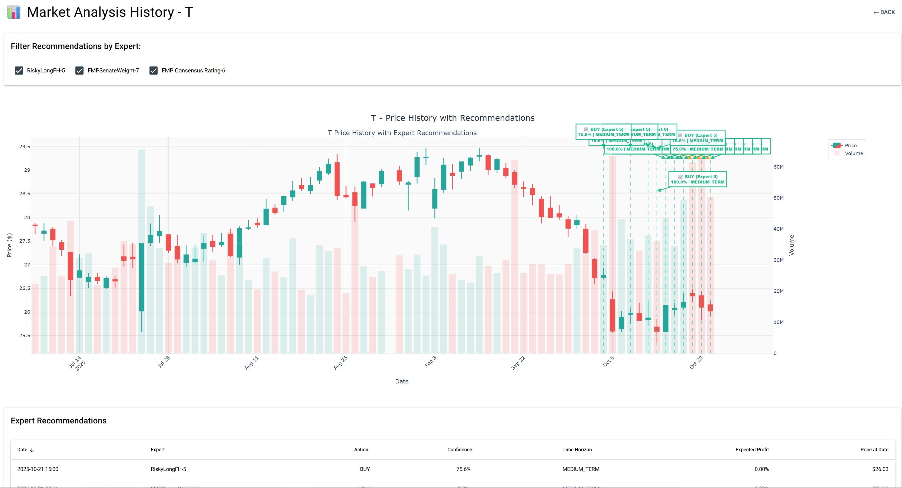

# BA2 Trade Platform

A sophisticated Python-based algorithmic trading platform featuring AI-driven market analysis, multi-agent trading strategies, and a comprehensive plugin architecture for accounts and market experts.

## � Screenshots

### Dashboard Overview

*Main dashboard showing account summary and position overview*

### AI Analysis Details

*Multi-agent AI analysis with detailed recommendations and technical indicators*

### Trade Recommendations

*AI-generated trading recommendations with confidence levels and action items*

### Recommendation History

*Historical view of all generated recommendations and their performance*

## �🚧 ALPHA SOFTWARE - UNSTABLE

**⚠️ THIS PROJECT IS CURRENTLY IN ALPHA STAGE AND CONSIDERED UNSTABLE ⚠️**

- 🧪 **Experimental Release**: This is pre-beta software with active development and breaking changes
- 🔄 **Frequent Updates**: APIs, database schema, and core functionality may change without notice
- 🐛 **Expect Bugs**: Known and unknown issues exist throughout the platform
- 📝 **Incomplete Features**: Some functionality may be partially implemented or missing
- 🔧 **Developer Focused**: Currently intended for developers and advanced users willing to troubleshoot
- 💾 **No Migration Guarantees**: Database schema changes may require fresh installations
- 📋 **Documentation Gaps**: Some features may lack complete documentation

**USE ONLY FOR TESTING AND DEVELOPMENT - NOT SUITABLE FOR PRODUCTION TRADING**

## ⚠️ IMPORTANT DISCLAIMER

**THIS SOFTWARE IS PROVIDED "AS-IS" WITHOUT WARRANTY OF ANY KIND.**

- 🚨 **Trading involves substantial risk of loss** and is not suitable for all investors
- 🧪 **This software is experimental** and should be thoroughly tested in paper trading mode before considering live trading
- 💰 **You can lose money** - possibly all of your investment capital
- 🤖 **AI-driven decisions are not infallible** - algorithms can make mistakes, markets are unpredictable
- 📉 **Past performance does not guarantee future results** - backtesting and historical analysis may not reflect real trading conditions
- ⚙️ **Software bugs may exist** - thoroughly review all code and test extensively before use
- 🔒 **Use at your own risk and discretion** - you are solely responsible for any trading decisions and their outcomes
- 💼 **Not financial advice** - this platform is a tool for educational and research purposes

**RECOMMENDED PRACTICES:**
- ✅ Start with paper trading to familiarize yourself with the platform
- ✅ Set strict risk limits and position sizing rules
- ✅ Monitor all automated trades closely
- ✅ Never invest more than you can afford to lose
- ✅ Understand the underlying strategies and code before enabling automation
- ✅ Keep detailed logs and review trading decisions regularly
- ✅ Test thoroughly in various market conditions before live deployment

By using this software, you acknowledge that you understand and accept these risks.

## 🚀 Features

### Core Platform
- **Plugin Architecture**: Extensible system for trading accounts and market experts
- **SQLModel ORM**: Modern database layer with SQLite backend
- **NiceGUI Web Interface**: Clean, responsive web UI for configuration and monitoring
- **Extensible Settings**: Flexible configuration system for all plugins
- **Centralized Logging**: Comprehensive logging with file rotation and colored output

### AI Trading Agents
- **Multiple Expert Support**: Extensible plugin architecture supporting multiple expert types ([see EXPERTS.md](EXPERTS.md) for complete list)
- **Parallel Market Analysis**: Simultaneous analysis across multiple symbols for efficient processing
- **Multi-Agent Analysis**: Market, news, fundamentals, social media, and macro-economic analysts
- **TradingAgents Integration**: Advanced multi-agent LLM framework for financial trading
- **Government Trading Data**: FMP Senate/House trading analysis with both weighted algorithms and simple copy trading
- **Analyst Consensus**: Finnhub and FMP analyst rating aggregation and price target analysis
- **FRED API Integration**: Real-time macroeconomic data analysis
- **Debate-Based Decision Making**: Bull vs bear researcher debates with research manager oversight
- **Risk Management**: Multi-layered risk analysis and management

### Trading Modes & Risk Management
- **Semi-Automatic Trading**: Human approval required for trade execution
- **Full Automatic Trading**: Autonomous trading based on AI recommendations
- **Virtual Equity Management**: Split account balance across multiple experts to limit individual risk
- **Expert-Level Risk Controls**: Configurable risk limits per expert instance
- **Portfolio Diversification**: Automatic allocation management across different strategies

### Market Data & APIs
- **Multiple Data Sources**: Alpaca, Finnhub, SimFin, Yahoo Finance, FRED
- **Real-Time & Historical Data**: Comprehensive market data coverage
- **Economic Indicators**: Inflation, employment, treasury yields, economic calendar
- **Social Sentiment**: Reddit and social media sentiment analysis

### Trading Features
- **Multi-Expert Support**: Run multiple AI experts simultaneously with individual risk management
- **Parallel Symbol Analysis**: Analyze multiple instruments concurrently for faster decision-making
- **Automated Trade Execution**: Semi-automatic (manual approval) or fully automatic trading modes
- **Virtual Account Splitting**: Allocate portions of your account to different experts to limit exposure
- **Risk-Based Position Sizing**: Dynamic position sizing based on expert confidence and risk assessment
- **Expert Performance Tracking**: Monitor and compare performance across different expert strategies

### Account Providers
- **Alpaca Integration**: Paper and live trading support
- **Extensible Architecture**: Easy addition of new brokers via AccountInterface

## 🤖 Available Trading Experts

The platform includes multiple AI trading experts with different strategies and capabilities:

| Expert | Description | Data Sources | Special Features |
|--------|-------------|--------------|------------------|
| **TradingAgents** | Multi-agent AI system with debate-based analysis | Market data, news, fundamentals | Complex AI analysis, agent debates |
| **FinnHubRating** | Analyst consensus tracker | Finnhub analyst ratings | Weighted consensus scoring |
| **FMPRating** | Price target analyzer | FMP analyst data | Profit potential calculation |
| **FMPSenateTraderWeight** | Government trading tracker (sophisticated) | FMP Senate/House data | Portfolio allocation analysis |
| **FMPSenateTraderCopy** | Government trading tracker (simple copy) | FMP Senate/House data | 100% confidence copy trading, can recommend instruments |

📖 **For detailed documentation on all experts, their settings, and configuration options, see [EXPERTS.md](EXPERTS.md)**

## 📋 Requirements

- Python 3.11+
- SQLite (included)
- OpenAI API Key (or compatible LLM provider)
- Optional: Alpaca API Key, Finnhub API Key, FRED API Key, FMP API Key

## 🔑 API Keys Configuration

The platform requires certain API keys to function properly. Configure all API keys through the **Settings** page at `http://localhost:8080/settings`.

### 🟥 Mandatory API Keys

**LLM Configuration** (Required - Choose One or Both)

The platform supports both **OpenAI** and **NagaAI** for AI-driven market analysis. You must configure at least one LLM provider.

#### Option 1: OpenAI (Standard)
- **Purpose**: Powers all AI trading experts and analysis
- **Used by**: TradingAgents multi-agent framework, market analysis, recommendation generation
- **Get it**: [OpenAI API Platform](https://platform.openai.com/api-keys)
- **Configure**: Settings → Application Settings → OpenAI API Key

#### Option 2: NagaAI (Alternative Provider)
- **Purpose**: Cost-effective alternative to OpenAI with competitive models
- **Used by**: TradingAgents multi-agent framework, market analysis, recommendation generation
- **Get it**: [NagaAI Platform](https://www.nagaai.com) - Sign up and create API key
- **Configure**: Settings → Application Settings → NagaAI API Key
- **Backend URL**: `https://api.nagaai.com/v1` (automatically configured)

#### Switching Between Providers

**In Web Interface** (Recommended):
1. Navigate to Settings → Application Settings
2. Choose your LLM provider:
   - Enter OpenAI API Key if using OpenAI
   - Enter NagaAI API Key if using NagaAI
3. Select your preferred model from the dropdown
4. Click Save - the platform automatically uses the configured provider

#### Performance Comparison

| Feature | OpenAI | NagaAI |
|---------|--------|--------|
| **Cost** | Higher | Lower (often 50-70% cheaper) |
| **Latency** | Very fast | Fast |
| **Rate Limits** | Per-plan | Per-plan |
| **Setup Time** | Immediate | Immediate |
| **Best For** | Premium features | Budget-conscious users |

#### Recommendation

- **Production Trading**: Use OpenAI for reliability and latest models
- **Testing/Development**: Use NagaAI for cost savings
- **Hybrid Approach**: Configure both and switch based on market conditions

#### Expert Settings and Model Selection

- Model and provider selection for AI experts is managed per-expert in the "Expert Settings" section of the web UI (Settings → Experts or the specific expert configuration page).
- Model names include a provider prefix so the platform can route requests to the correct backend:
    - OpenAI models appear with the prefix `OpenAI/` (for example `OpenAI/gpt-4-turbo`)
    - NagaAI models appear with the prefix `NagaAI/` (for example `NagaAI/claude-3-sonnet`)
- You can also choose which provider an expert uses in the same Expert Settings UI. This is a per-expert selection — different experts may use different providers concurrently.
- Important: It is the user's responsibility to add and configure valid API keys for any provider you select before enabling or running an expert. If an expert is configured to use a provider but no valid API key is present, the expert may receive empty responses or fail during execution.

### 🟡 Conditional API Keys (Required based on configuration)

**Alpaca API Keys** (Required if using Alpaca account provider)

Alpaca API keys are used at two levels:

1. **Application Level** (Optional - for market data/news):
   - **Purpose**: Used by platform for real-time market prices and news data
   - **Configure**: Settings → Application Settings → Alpaca API Key
   - **Used by**: Market data retrieval, price feeds for analysis

2. **Per-Account Level** (Required for trading):
   - **Purpose**: Live or paper trading account credentials
   - **Configure**: Settings → Accounts → Add Alpaca Account
   - **Keys needed**: API Key + Secret Key for each trading account
   - **Used by**: Order execution, position tracking, account management

- **Without account-level keys**: Cannot trade through Alpaca (but can still use other trading providers or paper trading accounts)
- **Without app-level keys**: Platform uses alternative data sources for market data; reduced real-time market data accuracy

### 🟢 Optional API Keys (Enhance functionality)

**Finnhub API Key** (Optional - enhances market data)
- **Purpose**: Additional market data, news, and fundamental analysis
- **Used by**: TradingAgents news analyst, fundamental analysis
- **Get it**: [Finnhub API](https://finnhub.io/register)
- **Configure**: Settings → Application Settings → Finnhub API Key
- **Without this**: Uses alternative data sources, reduced analysis depth

**FRED API Key** (Optional - enhances macro analysis)
- **Purpose**: Federal Reserve economic data for macro analysis
- **Used by**: TradingAgents macro analyst for economic indicators
- **Get it**: [FRED API](https://fred.stlouisfed.org/docs/api/api_key.html)
- **Configure**: Settings → Application Settings → FRED API Key
- **Without this**: Macro analysis uses limited economic data

**FMP API Key** (Optional - enhances fundamental data)
- **Purpose**: Financial Modeling Prep API for company fundamentals
- **Used by**: TradingAgents fundamental analyst for detailed financial metrics
- **Get it**: [Financial Modeling Prep](https://financialmodelingprep.com/developer/docs)
- **Configure**: Settings → Application Settings → FMP API Key
- **Without this**: Limited fundamental analysis capabilities

### 🔧 Configuration Methods

All API keys should be configured through the **Web Interface** (Recommended):
- Navigate to `http://localhost:8080/settings`
- Enter API keys in respective sections (OpenAI or NagaAI)
- Select your preferred LLM model
- Keys are stored in local database

### 🛡️ Security Notes

- API keys are stored in the local SQLite database - keep the database file secure
- Keys are never transmitted except to their respective API endpoints
- Use paper trading accounts for testing (Alpaca provides free paper trading)
- Keep your API keys secure and never share them publicly
- Regularly rotate API keys as a security best practice

## 🛠️ Installation

### Prerequisites
- Python 3.11 or higher
- Git
- Windows/Linux/macOS

### Step-by-Step Setup

1. **Clone the repository**:
   ```bash
   git clone https://github.com/bmigette/BA2TradePlatform.git
   cd BA2TradePlatform
   ```

2. **Choose your package manager**:

   #### Option A: Using `uv` (⚡ RECOMMENDED - Much Faster!)
   
   `uv` is a blazingly fast Python package installer and resolver, written in Rust. It's **10-100x faster** than pip for installing packages.
   
   **Install uv** (if not already installed):
   ```bash
   # Windows (PowerShell)
   powershell -ExecutionPolicy ByPass -c "irm https://astral.sh/uv/install.ps1 | iex"
   
   # Linux/macOS
   curl -LsSf https://astral.sh/uv/install.sh | sh
   ```
   
   **Create virtual environment and install dependencies**:
   ```bash
   # Create venv and install dependencies in one command
   uv venv
   uv pip install -r requirements.txt
   ```
   
   **Activate the virtual environment**:
   ```bash
   # Windows
   .venv\Scripts\Activate.ps1
   
   # Linux/macOS
   source .venv/bin/activate
   ```

   #### Option B: Using standard `pip` (Traditional Method)
   
   **Create and activate virtual environment**:
   
   **Windows**:
   ```powershell
   python -m venv .venv
   .venv\Scripts\Activate.ps1
   ```
   
   **Linux/macOS**:
   ```bash
   python -m venv .venv
   source .venv/bin/activate
   ```

   **Install dependencies**:
   ```bash
   # Windows
   .venv\Scripts\python.exe -m pip install -r requirements.txt
   
   # Linux/macOS
   .venv/bin/python -m pip install -r requirements.txt
   ```

5. **Run the application**:
   
   **Windows**:
   ```powershell
   .venv\Scripts\python.exe main.py
   ```
   
   **Linux/macOS**:
   ```bash
   .venv/bin/python main.py
   ```

### Command-Line Arguments

The application supports command-line arguments to customize data folders and HTTP port:

```bash
python main.py [options]
```

**Available Options**:

| Option | Description | Default |
|--------|-------------|---------|
| `--db-file` | Path to the SQLite database file | `~/Documents/ba2_trade_platform/db.sqlite` |
| `--cache-folder` | Path to the cache folder for temporary data | `~/Documents/ba2_trade_platform/cache` |
| `--log-folder` | Path to the log folder | `./logs` |
| `--port` | HTTP port for the web interface | `8080` |

**Examples**:

```bash
# View help
python main.py --help

# Use custom database path
python main.py --db-file /data/trading/database.sqlite

# Use custom port
python main.py --port 9090

# Combine multiple options
python main.py --db-file /data/trading.db --cache-folder /tmp/cache --log-folder /var/log/ba2 --port 3000

# Development setup (separate database)
python main.py --db-file ./dev_database.sqlite --port 8081

# Production setup
python main.py --db-file /opt/ba2/production.db --cache-folder /opt/ba2/cache --log-folder /var/log/ba2 --port 80
```

**Notes**:
- All folder paths are created automatically if they don't exist
- The database file's parent directory is also created automatically
- Arguments are parsed before any system initialization occurs
- The `--help` option shows all available options without starting the application

6. **Access the web interface**:
   
   Open your browser and navigate to:
   ```
   http://localhost:8080
   ```

### First-Time Configuration

After starting the application:

1. **Navigate to Settings** (http://localhost:8080/settings)
2. **Configure API Keys**: Enter your OpenAI, Finnhub, and other API keys
3. **Add Trading Account**: Configure your Alpaca or other broker credentials
4. **Create Expert Instance**: Set up your first AI trading expert
5. **Configure Rulesets**: Define your trading rules and risk parameters

### Database Location

The SQLite database is automatically created at:
```
~/Documents/ba2_trade_platform/db.sqlite
```

Logs are stored in:
```
ba2_trade_platform/logs/
```

Cache (ChromaDB, price data) is stored in:
```
~/Documents/ba2_trade_platform/cache/
```

## 🐳 Docker Installation (Recommended for Production)

BA2 Trade Platform can be easily run in Docker with persistent data storage. The Docker setup uses separate volumes for database and cache, allowing you to persist only what you need.

### Prerequisites
- [Docker](https://docs.docker.com/get-docker/) 20.10+
- [Docker Compose](https://docs.docker.com/compose/install/) 1.29+ (optional but recommended)

### Quick Start with Docker Compose (Easiest)

**1. Clone the repository**:
```bash
git clone https://github.com/bmigette/BA2TradePlatform.git
cd BA2TradePlatform
```

**2. Start the platform**:
```bash
docker-compose up -d
```

This will:
- Build the Docker image from Dockerfile
- Create three named volumes (`ba2_db_volume`, `ba2_cache_volume`, `ba2_logs_volume`)
- Start the container with web interface on port 8000
- Automatically restart if the container stops

**3. Access the web interface**:
```
http://localhost:8000
```

**4. View logs**:
```bash
docker-compose logs -f
```

**5. Stop the platform**:
```bash
docker-compose down
```

### Docker Compose Volume Management

The `docker-compose.yml` file defines three independent volumes:

| Volume | Purpose | Path in Container |
|--------|---------|-------------------|
| `ba2_db_volume` | Database persistence | `/opt/ba2_trade_platform/db` |
| `ba2_cache_volume` | Cache persistence | `/opt/ba2_trade_platform/cache` |
| `ba2_logs_volume` | Logs persistence | `/opt/ba2_trade_platform/logs` |

**Persist Only Database** (best for development):
```yaml
volumes:
  - ba2_db_volume:/opt/ba2_trade_platform/db
  # Don't mount cache or logs - they'll be ephemeral
```

**Persist Only Cache** (for stateless deployments):
```yaml
volumes:
  - ba2_cache_volume:/opt/ba2_trade_platform/cache
```

**Persist Everything** (default in docker-compose.yml):
```yaml
volumes:
  - ba2_db_volume:/opt/ba2_trade_platform/db
  - ba2_cache_volume:/opt/ba2_trade_platform/cache
  - ba2_logs_volume:/opt/ba2_trade_platform/logs
```

### Using Docker Without Compose

**1. Build the image**:
```bash
docker build -t ba2-trade-platform:latest .
```

**2. Create volumes** (optional but recommended):
```bash
docker volume create ba2_db_volume
docker volume create ba2_cache_volume
docker volume create ba2_logs_volume
```

**3. Run the container**:
```bash
docker run -d \
  --name ba2-trade-platform \
  -p 8000:8000 \
  -v ba2_db_volume:/opt/ba2_trade_platform/db \
  -v ba2_cache_volume:/opt/ba2_trade_platform/cache \
  -v ba2_logs_volume:/opt/ba2_trade_platform/logs \
  ba2-trade-platform:latest
```

**4. Access the web interface**:
```
http://localhost:8000
```

### Docker Run Examples

**Development Setup** (persist only database):
```bash
docker run -d \
  --name ba2-dev \
  -p 8001:8000 \
  -v ba2_dev_db:/opt/ba2_trade_platform/db \
  ba2-trade-platform:latest
```

**Production Setup** (persist everything, custom port):
```bash
docker run -d \
  --name ba2-prod \
  -p 80:8000 \
  --restart unless-stopped \
  -v ba2_prod_db:/opt/ba2_trade_platform/db \
  -v ba2_prod_cache:/opt/ba2_trade_platform/cache \
  -v ba2_prod_logs:/opt/ba2_trade_platform/logs \
  ba2-trade-platform:latest
```

**Custom Database Location** (use host folder instead of volume):
```bash
mkdir -p /data/ba2-trade/db /data/ba2-trade/cache
chmod 755 /data/ba2-trade/*

docker run -d \
  --name ba2-custom \
  -p 8000:8000 \
  -v /data/ba2-trade/db:/opt/ba2_trade_platform/db \
  -v /data/ba2-trade/cache:/opt/ba2_trade_platform/cache \
  ba2-trade-platform:latest
```

### Docker Volume Inspection

**List volumes**:
```bash
docker volume ls | grep ba2
```

**Inspect a volume**:
```bash
docker volume inspect ba2_db_volume
```

**View volume data** (Linux/macOS):
```bash
# Find where Docker stores volumes (Docker Desktop on macOS stores at ~/Library/Docker/volumes)
ls -la /var/lib/docker/volumes/ba2_db_volume/_data/
```

### Backing Up Data

**Backup database**:
```bash
docker cp ba2-trade-platform:/opt/ba2_trade_platform/db/db.sqlite ~/backup/db.sqlite
```

**Backup everything**:
```bash
docker run --rm \
  -v ba2_db_volume:/data/db \
  -v ba2_cache_volume:/data/cache \
  -v ba2_logs_volume:/data/logs \
  -v ~/backup:/backup \
  ubuntu tar czf /backup/ba2-backup-$(date +%Y%m%d).tar.gz /data
```

### Cleaning Up

**Stop and remove container**:
```bash
docker-compose down
# or
docker stop ba2-trade-platform
docker rm ba2-trade-platform
```

**Remove volumes** (CAUTION - deletes data):
```bash
docker-compose down -v
# or
docker volume rm ba2_db_volume ba2_cache_volume ba2_logs_volume
```

**Remove image**:
```bash
docker rmi ba2-trade-platform:latest
```

### Docker Environment Details

The Dockerfile:
- **Base Image**: `python:3.11-slim` (minimal footprint)
- **Multi-stage Build**: Reduces final image size
- **Non-root User**: Runs as `trader` user for security
- **Working Directory**: `/app`
- **Exposed Port**: `8000` (web interface)
- **Entry Point**: Automatically starts with proper volume paths

**Default Paths in Container**:
- Database: `/opt/ba2_trade_platform/db/db.sqlite`
- Cache: `/opt/ba2_trade_platform/cache`
- Logs: `/opt/ba2_trade_platform/logs`

### Troubleshooting Docker

**Port Already in Use**:
```bash
# Change port in docker-compose.yml or use different port
docker run -p 9000:8000 ba2-trade-platform:latest

# Check what's using port 8000
lsof -i :8000  # Linux/macOS
netstat -ano | findstr :8000  # Windows
```

**Container Won't Start**:
```bash
# View detailed logs
docker logs ba2-trade-platform

# Or with compose
docker-compose logs -f ba2-trade-platform

# Check container status
docker ps -a | grep ba2
```

**Data Persistence Issues**:
```bash
# Verify volumes exist
docker volume ls | grep ba2

# Check volume data
docker volume inspect ba2_db_volume

# View volume contents
docker run --rm -v ba2_db_volume:/data ubuntu ls -la /data
```

**Permission Denied Errors**:
- Docker container runs as non-root user `trader` (UID 1000)
- If using host directories, ensure they have proper permissions:
```bash
mkdir -p /data/ba2-trade/{db,cache}
chmod 755 /data/ba2-trade
chown -R 1000:1000 /data/ba2-trade
```

**Out of Disk Space**:
```bash
# Clean up unused volumes and images
docker system prune -a --volumes

# View disk usage
docker system df
```

**Database Corruption**:
- Delete the database volume and start fresh:
```bash
docker-compose down -v  # Removes all volumes
docker-compose up -d    # Creates new volumes with fresh database
```

### Troubleshooting Installation

**Virtual Environment Issues**:
- Always use the virtual environment Python executable (`.venv\Scripts\python.exe` or `.venv/bin/python`)
- Avoid using global `python` or `pip` commands

**Dependency Installation Errors**:
```bash
# With uv (recommended - much faster)
uv pip install -r requirements.txt

# Or with pip (upgrade first)
.venv\Scripts\python.exe -m pip install --upgrade pip
.venv\Scripts\python.exe -m pip install -r requirements.txt
```

**Port Already in Use**:
- NiceGUI runs on port 8080 by default
- Check for other applications using this port
- Stop conflicting services or use `--port` argument:
```bash
python main.py --port 9090
```

**Permission Errors**:
- Ensure you have write permissions in `~/Documents/`
- Run terminal/PowerShell with appropriate permissions

## 🏗️ Architecture

### Core Interfaces

#### AccountInterface
Abstract base class for trading account implementations:
```python
class AccountInterface(ExtendableSettingsInterface):
    def get_account_info(self) -> dict
    def submit_order(self, order_data: dict) -> dict
    def get_positions(self) -> List[dict]
    def get_orders(self) -> List[dict]
```

#### MarketExpertInterface  
Abstract base class for AI trading experts:
```python
class MarketExpertInterface(ExtendableSettingsInterface):
    def get_prediction_for_instrument(self, symbol: str) -> dict
    def get_analysis_for_instruments(self, symbols: List[str]) -> dict
```

#### ExtendableSettingsInterface
Base class providing flexible configuration:
```python
@classmethod
def get_settings_definitions(cls) -> Dict[str, Any]:
    return {
        "setting_name": {
            "type": "str",
            "required": True, 
            "description": "Setting description"
        }
    }
```

### Database Models

**Core Models** (in `ba2_trade_platform/core/models.py`):
- `AppSetting`: Application-wide configuration (API keys, settings)
- `AccountDefinition`: Trading account provider configurations
- `AccountSetting`: Account-specific settings (key-value storage)
- `ExpertInstance`: AI expert configurations with virtual equity allocation and rulesets
- `ExpertSetting`: Expert-specific settings (key-value storage)
- `ExpertRecommendation`: Trading recommendations with risk level, time horizon, and confidence
- `MarketAnalysis`: Analysis sessions with status tracking and expert linking
- `AnalysisOutput`: Detailed analysis outputs from individual agents
- `TradingOrder`: Order lifecycle tracking (PENDING → OPEN → FILLED/CLOSED)
- `Transaction`: Transaction history for orders (fills, partial fills)
- `Position`: Current positions with P&L tracking
- `Instrument`: Instrument metadata (symbols, exchanges, asset classes)
- `Ruleset`: Rule-based trading logic containers
- `EventAction`: Conditional actions within rulesets
- `RulesetEventActionLink`: Many-to-many relationship for rulesets and actions
- `TradeActionResult`: Results from executed trade actions (BUY, SELL, CLOSE, etc.)

### Directory Structure

```
ba2_trade_platform/
├── core/                           # Core interfaces and models
│   ├── AccountInterface.py         # Account provider interface
│   ├── MarketExpertInterface.py    # Expert interface
│   ├── ExtendableSettingsInterface.py # Settings management
│   ├── models.py                   # SQLModel database models
│   ├── types.py                    # Enums (OrderStatus, OrderDirection, RiskLevel, etc.)
│   ├── db.py                       # Database utilities (CRUD operations)
│   ├── utils.py                    # Helper functions
│   ├── actions.py                  # Trade action helpers
│   ├── TradeManager.py             # Order processing and recommendation handling
│   ├── TradeActionEvaluator.py     # Ruleset evaluation engine
│   ├── TradeActions.py             # Trade action implementations (BUY, SELL, CLOSE)
│   ├── TradeConditions.py          # Condition evaluation for rulesets
│   ├── TradeRiskManagement.py      # Risk management and position sizing
│   ├── JobManager.py               # Background job scheduling
│   ├── WorkerQueue.py              # Task queue for parallel processing
│   ├── MarketAnalysisPDFExport.py  # Export analysis to PDF reports
│   ├── rules_documentation.py      # Ruleset documentation generator
│   └── rules_export_import.py      # Import/export rulesets
├── modules/
│   ├── accounts/                   # Account implementations
│   │   ├── __init__.py            # Account registry
│   │   └── AlpacaAccount.py        # Alpaca integration
│   ├── experts/                    # Expert implementations
│   │   ├── __init__.py            # Expert registry
│   │   └── TradingAgents.py        # Multi-agent LLM expert
│   └── marketinfo/                 # Market information providers
├── thirdparties/
│   └── TradingAgents/              # TradingAgents multi-agent framework
├── ui/                             # NiceGUI web interface
│   ├── main.py                     # Route definitions and app initialization
│   ├── layout.py                   # Page layout components
│   ├── menus.py                    # Navigation menus
│   ├── svg.py                      # SVG icon utilities
│   ├── pages/                      # Page components
│   │   ├── overview.py            # Dashboard and account overview
│   │   ├── marketanalysis.py       # Market analysis management
│   │   └── settings.py            # Configuration interface
│   ├── components/                 # Reusable UI components
│   │   └── InstrumentSelector.py   # Instrument selection widget
│   └── static/                     # Static assets (favicons, etc.)
├── logs/                           # Application logs
├── config.py                       # Global configuration
└── logger.py                       # Centralized logging
```

## 🤖 TradingAgents Framework

The platform integrates the TradingAgents multi-agent framework for sophisticated market analysis:

### Agent Types
- **Market Analyst**: Technical analysis and price patterns
- **News Analyst**: News sentiment and impact analysis  
- **Fundamentals Analyst**: Company financials and metrics
- **Social Media Analyst**: Social sentiment analysis
- **Macro Analyst**: Economic indicators and macro trends
- **Bull/Bear Researchers**: Debate-based analysis
- **Research Manager**: Synthesis and final recommendations

### Analysis Workflow
1. **Data Collection**: Multi-source data gathering
2. **Agent Analysis**: Parallel analysis by specialized agents
3. **Debate Phase**: Bull vs bear researcher arguments
4. **Synthesis**: Research manager consolidation
5. **Risk Assessment**: Multi-perspective risk analysis
6. **Final Recommendation**: Trading decision with confidence levels

## 🎛️ Configuration

### Web Interface
Access the settings page at http://localhost:8080/settings to configure:
- API Keys (OpenAI, Finnhub, FRED)
- Account Providers (Alpaca credentials)
- Expert Settings (TradingAgents parameters)

### Logging Configuration
Modify `ba2_trade_platform/config.py`:
```python
STDOUT_LOGGING = True   # Console output
FILE_LOGGING = True     # File logging with rotation
```

## 🔌 Extending the Platform

> 📖 **For detailed information about existing experts and their implementation patterns, see [EXPERTS.md](EXPERTS.md)**

### Adding New Account Provider

1. **Create provider class**:
```python
from ba2_trade_platform.core.AccountInterface import AccountInterface

class MyBrokerAccount(AccountInterface):
    @classmethod
    def get_settings_definitions(cls):
        return {
            "api_key": {"type": "str", "required": True},
            "paper_trading": {"type": "bool", "required": True}
        }
    
    def get_account_info(self):
        # Implementation here
        pass
```

2. **Register in UI**: The provider will automatically appear in the web interface

### Adding New Market Expert

1. **Create expert class**:
```python
from ba2_trade_platform.core.MarketExpertInterface import MarketExpertInterface

class MyExpert(MarketExpertInterface):
    @classmethod  
    def get_settings_definitions(cls):
        return {
            "model_type": {"type": "str", "required": True},
            "confidence_threshold": {"type": "float", "required": True}
        }
    
    def get_prediction_for_instrument(self, symbol: str):
        # Implementation here
        pass
```

## 📊 Database Schema

The platform uses SQLModel for ORM with automatic SQLite database creation:

**Key Tables**:
- `appsetting`: Application-wide configuration and API keys
- `accountdefinition`: Trading account provider configurations
- `accountsetting`: Account-specific settings (key-value)
- `expertinstance`: AI expert configurations with rulesets and virtual equity
- `expertsetting`: Expert-specific settings (key-value)
- `expertrecommendation`: Trading recommendations with risk/confidence metrics
- `marketanalysis`: Analysis job tracking with status and timing
- `analysisoutput`: Detailed outputs from individual analysis agents
- `tradingorder`: Order lifecycle and execution tracking
- `transaction`: Transaction history for order fills
- `position`: Current positions with unrealized P&L
- `instrument`: Instrument metadata and specifications
- `ruleset`: Rule-based trading logic containers
- `eventaction`: Conditional actions (triggers and actions)
- `ruleseteventactionlink`: Many-to-many relationship for rulesets
- `tradeactionresult`: Results from executed trade actions

**Database Features**:
- Automatic schema creation and migrations via Alembic
- SQLite backend with full ACID compliance
- Foreign key constraints for data integrity
- Indexed fields for query performance

Database auto-initializes at: `~/Documents/ba2_trade_platform/db.sqlite`

## 🧪 Testing

**Run TradingAgents test**:
```bash
python test_trade_agents.py
```

**Basic functionality test**:
```bash
python test.py
```

## 📝 Logging

**File Locations**:
- Main logs: `ba2_trade_platform/logs/app.log`
- Debug logs: `ba2_trade_platform/logs/app.debug.log` 
- TradingAgents logs: `./tradeagents-exp{id}.log`

**Log Features**:
- Automatic rotation (10MB max, 5 backups)
- Colored console output with icons
- Expert-specific log files
- Configurable log levels

## 🔧 Development

**Project Structure**:
- Core interfaces in `ba2_trade_platform/core/`
- Implementations in `ba2_trade_platform/modules/`
- Web UI in `ba2_trade_platform/ui/`
- Third-party integrations in `ba2_trade_platform/thirdparties/`

**Adding Dependencies**:
```bash
# With uv (recommended)
uv pip install new_package
uv pip freeze > requirements.txt

# Or with pip
pip install new_package
pip freeze > requirements.txt
```

## 🚀 Production Deployment

1. **Configure API keys via Settings page** at `/settings`
2. **Enable file logging**: Set `FILE_LOGGING = True` in config.py
3. **Run with production WSGI server** (if needed)
4. **Set up proper database backup strategy**

## 🐛 Troubleshooting

**Common Issues**:

1. **Import Errors**: Ensure all dependencies installed with `.venv\Scripts\python.exe -m pip install -r requirements.txt`

2. **Database Issues**: Database auto-creates on first run. Check permissions in `~/Documents/`

3. **API Key Issues**: Configure keys via web interface at `/settings`

4. **Unicode Console Errors**: Logger automatically falls back to ASCII on Windows

5. **ChromaDB Instance Conflicts**: Fixed in latest version - each expert/symbol combination now gets isolated ChromaDB storage

6. **AttributeError on TradingOrder**: Ensure database schema is up-to-date. The `filled_avg_price` field was removed in favor of `open_price`

**Debug Mode**:
```python
ta = TradingAgentsGraph(debug=True, config=DEFAULT_CONFIG)
```

## 📋 Recent Updates

### October 2025
- **Fixed ChromaDB Instance Conflicts**: ChromaDB path now includes symbol to prevent conflicts when same expert analyzes multiple symbols
- **Database Schema Improvements**: Added CASCADE foreign key constraints for proper cleanup when deleting accounts/experts
- **Removed Redundant Fields**: Cleaned up `TradingOrder` model by removing `filled_avg_price` (now uses `open_price`)
- **Trade Action Fixes**: 
  - Fixed Take Profit/Stop Loss calculation to use correct order direction (from recommendation vs. existing order)
  - Fixed increase/decrease instrument share actions to properly extract target percentage
- **Rule Evaluation Traceability**: Added detailed tracking of trade action results linked to expert recommendations
- **UI Enhancements**: Added magnifying glass icons for viewing detailed rule evaluation results

### Key Features Added
- **Async Price Loading**: Overview widgets load price information asynchronously to prevent UI blocking
- **Performance Analytics**: New trade performance tab with comprehensive metrics:
  - Average transaction time per expert
  - Total and monthly profit analysis
  - Sharpe ratio calculations
  - Win/loss ratio tracking
  - Average profit per transaction
- **Reusable Chart Components**: Modular chart components for consistent visualization across the platform

## 📚 Documentation

- **Core Interfaces**: See docstrings in `ba2_trade_platform/core/`
- **API Reference**: Auto-generated from type hints
- **Examples**: Check `test_trade_agents.py` and `test.py`

## 🤝 Contributing

1. Fork the repository
2. Create feature branch: `git checkout -b feature-name`
3. Make changes with proper tests
4. Submit pull request

## 📄 License

[Add your license information here]

---

# Credits

Project that uses *TradingAgents*  https://github.com/TauricResearch/TradingAgents

```
@misc{xiao2025tradingagentsmultiagentsllmfinancial,
      title={TradingAgents: Multi-Agents LLM Financial Trading Framework}, 
      author={Yijia Xiao and Edward Sun and Di Luo and Wei Wang},
      year={2025},
      eprint={2412.20138},
      archivePrefix={arXiv},
      primaryClass={q-fin.TR},
      url={https://arxiv.org/abs/2412.20138}, 
}
```