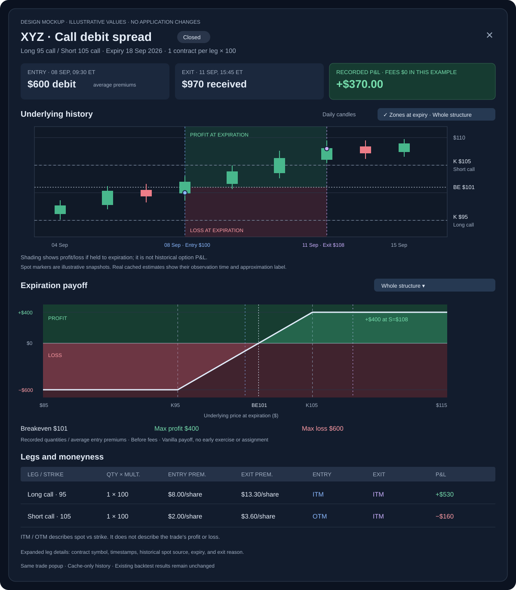

# Option trade details in backtest results

Date: 2026-09-20  
Status: specification only; application changes are not implemented.  
Scope: the test platform's existing trade chart popup, plus the same view ported to the live
platform's transaction-details popup.

## 0. Decisions locked 2026-09-20

| # | Decision |
|---|---|
| 1 | **1a — one chart.** The expiration payoff is overlaid on the candle chart, rotated onto the price axis: y = underlying price, x = position P&L, zero line vertical, green/red filled to zero, P&L scale along the top edge. The separate numeric payoff diagram is deferred (§7, out of scope) and the exact numbers move under the chart (§3B). |
| 2 | **2c — both marker sets, with a toggle**: the aggregate structure pair (first entry / last exit) and per-leg entry/exit markers labelled by leg. |
| 3 | **3 all — the live platform port** (`ba2-trade` transaction-details popup) gets option terms + leg table, then the price chart with markers, then the payoff overlay, in that order (§6). |
| 4 | **No new options page/menu.** `docs/superpowers/specs/2026-08-24-option-model-and-lifecycle-design.md` §8 names a "dedicated options UI page" as follow-up **F** in one line and never designs it — no scope, no mockup, nothing else in the docs tree references it. The live transaction-details popup is the delivery surface until that page is actually designed. |
| 5 | **Two tabs in Live Trades** (2026-09-20, follow-up to decision 3): **Stocks first/default, Options second**, each with its own columns, filters and totals, split strictly on `Transaction.asset_class`. See §6. |
| 6 | **Contract detail (greeks / IV / open interest) in the option popup** — asked 2026-09-20. Both runtimes already hold the data; nothing needs buying. See §9. |

## 1. Result to deliver

Clicking an option trade opens the same popup used for stock trades, with an underlying-price chart, entry and exit details, strike lines, each leg's ITM/ATM/OTM status, and the expiration payoff overlaid on that same chart so one view answers both "where was the underlying?" and "where would this position make or lose money?". Stock trades retain their existing view. The same view is ported to the live platform's transaction-details popup (§6).

The popup must answer three separate questions clearly:

1. **What happened?** Recorded entry/exit premiums, dates, quantities, and backtest P&L.
2. **Where was the underlying?** Historical underlying prices relative to the strikes at entry and exit.
3. **Where would this position make or lose money at expiration?** An overlaid expiration-payoff curve, plus breakeven and max profit/loss figures derived from the recorded position.

Green means positive position P&L; red means negative position P&L. **ITM does not mean profitable.** Moneyness badges use neutral colors. Expiration payoff is a hypothetical outcome, not a reconstruction of daily option valuation or the actual exit result.



The mockup uses invented values to demonstrate the distinction: the spread closes for a **$370 gross profit**, while holding it to expiration with the underlying at the same $108 would produce **$400**. No existing backtest result is represented by this illustration.

**The mockup predates decision 1a.** It draws the payoff as a second chart below the candles. The locked layout overlays the payoff on the candle chart (§3A) and keeps only the numbers under it (§3B). The mockup is retained for the summary cards, strike/moneyness treatment, and leg table.

## 2. Current code and findings

These observations come from source inspection, not a deployed UI test.

| Existing code | Finding and consequence |
|---|---|
| [`TradeChartModal.tsx`](../../testplatform/frontend/src/components/TradeChartModal.tsx) | Already renders daily candles with entry/exit markers and about 20 calendar days of context on each side. It accepts only stock-shaped fields. For an option, the marker labels use option premiums even though the candles can be the underlying stock. It has no strike lines, moneyness, or structure view. Extend this popup. |
| [`Backtesting.tsx`](../../testplatform/frontend/src/pages/Backtesting.tsx), `tradeRow`, `chartTrade`, structure table rows | Clicking an individual row opens the popup; a structure parent currently only expands its legs. Grouping uses the filtered table rows, which may omit some legs. Chart selection must resolve the complete transaction from the saved result. |
| [`optionTrades.ts`](../../testplatform/frontend/src/lib/optionTrades.ts) | Existing option detection, transaction grouping, and summaries can supply identity/presentation. `contractValue` substitutes 0/1 for missing values; use a separate strict input validator for payoff arithmetic. Do not change the old table helper's behavior as part of this feature. |
| [`backtest.py`](../../testplatform/backend/app/models/backtest.py), `_transform_trades_for_frontend` | Publishes `optionType`, `strike`, `expiry`, `multiplier`, `underlyingSymbol`, `contractSymbol`, and `transactionId`. Its row ID is the saved array index plus one. Missing multiplier can become 1 during presentation, so the new detail endpoint must inspect raw saved fields to distinguish recorded values from defaults. |
| [`backtest_account.py`](../../testplatform/backend/app/services/backtest/backtest_account.py), `get_round_trip_trades` | Option rows are grouped by transaction and contract. Prices are quantity-weighted averages; dates are first entry/latest exit. Rows can represent scaled entries/exits. `open_at_end` means a valuation at run end, not a closing fill. P&L includes the recorder's commissions. Underlying fill-time spot and a per-fill history are not published in these rows. |
| [`results.py`](../../testplatform/backend/app/services/backtest/results.py), `_trade_row` | Keeps contract terms and transaction identity, but does not add fill-time underlying snapshots. Existing result normalization can also supply a multiplier default. Do not claim every historical blob retains enough provenance to recover missing terms. |
| [`tools.py`](../../testplatform/backend/app/api/tools.py), `GET /tools/ohlcv/bars` | Uses a cached provider's normal `get_ohlcv_data` path. This is not a cache-only guarantee: missing/stale data can enter the provider fetch path. The request also lacks backtest identity. A separate read-only detail path should bind the chart to its result and cache source. |
| [`price_source.py`](../../testplatform/backend/app/services/backtest/price_source.py), `MemoizedOHLCVProvider`; [`daily_backtest_handler.py`](../../testplatform/backend/app/services/backtest/daily_backtest_handler.py) | Daily expert runs already use FMP and `cached_only=True`, with native cache path resolution. Reuse that cache layout and read conventions without starting a backtest or changing its data path. |

**No new database columns, migration, or historical backtest rerun is required for the first delivery.** Missing information must remain visibly unavailable or approximate.

### 2b. Live platform (`ba2-trade`) — what exists today

Verified by source inspection and read-only queries against both live DBs, 2026-09-20.

| Existing code | Finding and consequence |
|---|---|
| [`ui/menus.py`](../../ba2_trade_platform/ui/menus.py), `MENU_ITEMS` | Overview, Market Analysis, Activity Monitor, Live Trades, Portfolio Allocation, Tools, Settings. **There is no Options page or menu item, and there never was one in code.** Registered routes (`ui/main.py`) add `/market_analysis/{id}`, `/marketanalysishistory/{symbol}`, `/rulesettest`, `/smartriskmanagerdetail/{job_id}` — none is option-specific. SYMBOL360 lives as a tab inside Tools. |
| [`LiveTradesTable.py`](../../ba2_trade_platform/ui/components/LiveTradesTable.py), `ColumnDef` list | Symbol, Account, Direction, Expert, Qty, Open/Current/Close Price, Value/CapReq, TP, SL, Current/Closed P/L, Status, Orders, Created, Closed. **Zero option columns** — no strike, expiry, contract symbol, multiplier or leg grouping. The row expander shows the same fields. An option transaction **does** still render here, option-blind — see below. |
| [`live_trades.py`](../../ba2_trade_platform/ui/pages/live_trades.py), `_show_transaction_details_dialog` (L1747+) | The popup the port targets. Contents: overview cards (symbol, direction, quantity, status, open/close price, TP, SL, dates, expert), `meta_data` JSON viewer, related orders. **No option terms and no chart at all — not even for stock**, so the live side has no chart to reuse. |
| [`LiveTradesTable.py`](../../ba2_trade_platform/ui/components/LiveTradesTable.py) event wiring | The per-row button emits `view_transaction_details` → `_handle_view_transaction_details` → `_show_transaction_details_dialog`. This is the only hook needed; no new route. |
| [`marketanalysis.py`](../../ba2_trade_platform/ui/pages/marketanalysis.py), `classic_run_detail_rows` | The option risk manager's **decisions** are rendered (unranked, refusals-first, one row per decision, with the note that two option legs are two decisions). That is a run-detail view of *decisions*, not of contracts or transactions. |
| [`models.py`](../../packages/common/ba2_common/core/models.py), `Transaction` vs `TradingOrder` | Option terms live on the **order**: `contract_symbol`, `option_type`, `strike`, `expiry`, `underlying_symbol`, `multiplier`, `position_intent`, `option_strategy`. `Transaction` carries only a summary (`asset_class`, `option_strategy`, `expiry`, `multiplier`) — the DB `transaction` table has no `strike`/`option_type`/`contract_symbol` column. **The leg table must read orders, grouped by `transaction_id`.** |
| [`AlpacaAccount.py`](../../ba2_trade_platform/modules/accounts/AlpacaAccount.py), `alpaca_position_to_position`; `overview.py` open-positions table | The only place an option row can currently appear: the raw broker position book (`symbol` = OCC string, `asset_class`, qty, prices, market value, unrealized P/L) in Overview → "Open Positions Across All Accounts" and the Portfolio Allocation holdings panel. **No strike/expiry/underlying/multiplier** — terms must not be parsed out of the OCC symbol. |
| Live DBs, `transaction` + `tradingorder` | **No option trade has ever run live.** DEV 86 transactions / 243 orders, PROD 208 / 605 — 100% `EQUITY`, `option_strategy` all NULL, `expiry` all NULL, zero orders with `contract_symbol`. The option plumbing (`core/option_lifecycle_service.py`, `core/option_selector.py`) exists but has never held a real option position. |

**An option trade renders in Live Trades today — option-blind.** Option execution rolls up into the same `Transaction` object this page already lists: `Transaction` is the **intent** (one row, keyed on the **underlying ticker**, never an OCC string) and the child `TradingOrder` rows are the **legs** (`models.py`; design §3 of `2026-08-24-option-model-and-lifecycle-design.md`). So a live iron condor on ACN would appear as one ordinary row — `ACN`, direction, 4 contracts, a premium in the open-price column, TP/SL, P/L — and clicking it opens the same popup. What it would *not* show is any sign that it is an option: `asset_class`, `option_strategy`, `expiry` and `multiplier` all live on that `Transaction` row and appear in **none** of the table's columns or the popup (the 2026-08-24 design calls `multiplier=100` "the only tell that a row is an option", and nothing in the UI reads it). The port is therefore not "make option rows appear" — it is **make the existing row and popup option-aware**, which is the cheap half of this spec: the structure is already a single transaction with a known leg set, no grouping heuristic needed.

## 3. Interaction and layout

### Opening the popup

- Stock row: existing behavior.
- Standalone option row: open option details.
- Structure parent: open the entire structure. Its separate chevron button expands/collapses the table, with propagation stopped.
- Expanded leg: open the complete structure with that leg highlighted. The initial payoff remains **Whole structure**; a visible selector can switch to an individual leg.
- The table's hide/show control continues to change the existing what-if view only. It must not open the popup or remove legs from a structure's chart. Show a small note when the selected transaction contains rows hidden by the table's what-if selection.
- Resolve membership by `(backtestId, transactionId)` against all persisted result rows, not by symbol, current sorting, page, filter, or currently visible legs. Without a transaction ID, display the selected row only.
- Do not infer covered stock, a wheel cycle, or a roll's relationship from a shared ticker or overlapping dates.

### Header and summary

Use an option-specific layout up to approximately 1,200 px wide, with vertical scrolling inside a dialog capped at 90% viewport height. Keep the stock dialog's layout intact.

Header: underlying, contract/structure description, expiry or **Multiple expiries**, and closed/open status. Use a strategy name only when the terms unambiguously establish it; otherwise use **2-leg option position**, etc. Never use a job name to decide the payoff formula.

Summary cards:

| Card | Meaning |
|---|---|
| Entry | First entry timestamp; total net debit paid or credit received for the displayed quantities. State **average premiums** for aggregate rows. |
| Exit | Last exit timestamp and net exit value. For `open_at_end`, label **Marked at run end**, not Exit. Mixed closed/open legs show **Partly open**. |
| Backtest P&L | Stored dollar P&L, summed over the complete selected transaction. Green/red/neutral background by its sign. Label **includes recorded commissions** for this recorder; identify unknown fee treatment on older/other engines. |
| Contracts | Contracts per leg and multiplier. Avoid describing four one-contract condor legs as four condors. |

P&L percentages must identify their denominator. A leg's existing `pnlPercent` is account equity at entry, not premium return. Display an aggregate equity percentage only when a common entry-equity basis is established; otherwise show dollar P&L and omit the aggregate percentage. Do not derive a short-option return by dividing by received premium and call it account return.

### A. Underlying history: reuse the existing candle chart

- Fetch and label the **underlying**, never the OCC contract as an equity symbol. Use explicit `underlyingSymbol`, or a verified underlying from saved metadata; unresolved identity produces an empty state.
- Keep daily candles and the existing approximately 20-day context window. Opening the chart must not fetch missing padding from a provider.
- Draw one dashed horizontal line per distinct strike. Label side, right, strike, and leg quantity, e.g. **Long 1 Call · K $95**. Colliding labels share a tooltip or stacked legend.
- **Two marker sets, toggleable (decision 2c).** *Structure markers*: first entry and last exit, blue/violet — the stock popup's existing pair. *Leg markers*: every leg's entry and exit, labelled with the leg (side, right, strike, premium/share) and styled distinctly from the structure pair, so a leg that opened weeks apart from its sibling is visible on the bars. Default: both on for a multi-leg structure, structure pair only for a single-leg trade. Option premiums appear explicitly as **premium/share** in the tooltip and details table, never as a stock-axis price.
- Same-day entry/exit must show two distinguishable markers, in both marker sets. Preserve full timestamps in tooltips. Leg markers that land on the same bar must stack or collapse into one marker carrying a combined tooltip rather than overdraw each other. Use the source's exchange session date for daily bars; do not silently convert a date-only bar through the viewer's local timezone.
- Expiration can be shown as a vertical guide when it falls inside the loaded window. Do not extend the data request to expiration automatically for a trade closed earlier.
- **Payoff overlay (decision 1a — this replaces the second chart).** The expiration payoff is drawn on this same chart, rotated onto the price axis: **y = underlying price** (the chart's own axis), **x = position P&L in dollars**, zero line vertical, positive region filled green and negative red, with a **P&L scale along the top edge**. Default curve is the whole structure; an optional per-leg curve follows the scope selector.
  - It is a rendering of the payoff **function**, not a time series: it must never be emitted as dated data points and must never consume or fabricate values on the chart's time axis. The overlay is drawn in price space (chart overlay/primitive facilities, or an aligned layer driven by the chart's own coordinate conversion).
  - Multiple profitable regions must work — both wings of a long straddle, both tails of an iron condor.
  - The **fill** is limited to the displayed holding period so candles stay legible; the **curve** spans the displayed price range. If a clean fill is not achievable, draw the curve unfilled over a low-opacity band and say so in the caption.
  - The existing **Zones at expiry** behaviour is the degenerate case of this overlay (sign only, no magnitude) and is kept as the fallback when the curve cannot be drawn: shade horizontal underlying-price regions green where the whole selected payoff is positive and red where negative, **only across the displayed holding period**, with breakevens as the boundaries.
- Keep the caption visible: **Overlay shows profit/loss if held to expiration; it is not historical option P&L.** Low-opacity fills must leave candles legible. Disable the overlay when payoff inputs are incomplete or incompatible (§4).
- Because there is one chart, the figures the numeric diagram used to carry live under it: see §3B.
- For an aggregate row, markers mean first entry/latest exit; they are not a reconstruction of every fill. Cached context outside the holding period is explanatory only.

### B. Payoff numbers — the second chart is gone

Decision 1a folds the payoff into the candle chart, so this section is now the numeric summary that sits under it, not a chart of its own:

- One row of figures, each labelled with its scope (**Whole structure** or the selected leg): **net entry debit/credit**, **breakeven(s)**, **maximum profit**, **maximum loss**. These are the numbers the numeric diagram used to carry; they must be readable without hovering anything.
- The scope selector stays. It changes the overlay curve, the strike emphasis, the labels, and these figures together.
- **Unlimited** only for a mathematically unbounded tail; **Unavailable** is different and must be distinguishable from it.
- Same validation as §4: finite inputs, `q > 0`, `m > 0`, `K > 0`, `p >= 0`, no silent zeroes, no assumed multiplier — and if one leg's terms are missing, the **whole structure's** figures are unavailable rather than quietly computed without that leg.
- Caption: **Hypothetical expiration payoff from recorded quantities and average entry premiums. Before fees; assumes vanilla contract payoff and no early exercise/assignment.**
- Actual backtest P&L remains in the summary cards, separate from these figures. The exit spot guide must not put the actual exit P&L on the expiration curve or imply the trade exited at intrinsic value.
- No probability-of-profit area, Black-Scholes curve, IV slider, or inferred daily option P&L in the first delivery.
- A full numeric-axis diagram (x = price, y = P&L, green/red filled to a zero line) stays deferred (§7, out of scope) for the case where the rotated overlay reads badly on a dense price range.

### C. Leg details

Each row shows: Long/Short; Call/Put; contract symbol; strike; expiry; contracts; multiplier; entry timestamp and premium/share; exit timestamp and premium/share (or run-end mark); underlying entry/exit reference; ITM/ATM/OTM at each reference; recorded P&L; exit reason.

Moneyness and side badges use neutral/blue/violet styles, leaving green/red for P&L. On narrow screens the leg table can scroll horizontally; summary cards stack. Keyboard users can open a row, reach the chevron separately, close with Escape, and return focus to the originating row. Provide dialog labeling, focus containment, signed dollar values, and text labels so colors are not the only cue.

## 4. Calculation and historical-data rules

### Moneyness

For strike `K` and a historical underlying reference `S`:

| Right | ITM | ATM | OTM |
|---|---|---|---|
| Call | `S > K` | `S = K` | `S < K` |
| Put | `S < K` | `S = K` | `S > K` |

Long/short does not invert these labels. ATM means equality at the recorded price precision; allow only floating-point comparison tolerance (`1e-9 * max(1, abs(S), abs(K))`), not a discretionary near-the-money band. Rounded labels must not change the calculation. Optional distance uses `100 * (S - K) / K`, explicitly labeled **spot vs strike**, not return.

Resolve each event's underlying reference in this order:

1. A recorded underlying snapshot attached to that event, if one exists. Keep its timestamp/source. Do not relabel an option fill price as spot.
2. A cached historical observation with known availability at or before the event. Use the newest eligible completed observation from the run's source, and label **Approximate · last known bar** with its timestamp and age.
3. Otherwise **Underlying at entry/exit unavailable**, with moneyness **Unknown**.

The current trade payload lacks option-fill underlying snapshots, so path 2 or 3 will normally apply. A daily close on the entry day is not known at a morning entry. A bar stamped at midnight is not evidence its close was available then: use session close/effective-time semantics. A completed intraday bar is also an estimate, not a simultaneous underlying quote. Session-open prices may only be used when the event and bar-open semantics are established.

If only date-level event timestamps exist, label the reference **Daily reference**, not an exact fill-time price. Unsupported or ambiguous timezone/availability semantics leave the value unknown. Do not search forward to a later bar. Always distinguish at-entry moneyness from current moneyness; no current quotes belong in this popup.

Strikes and spot must share a price-adjustment basis. Do not overlay nominal contract strikes on split-adjusted historical candles without a verified conversion. If adjustment/deliverable compatibility cannot be established, show the history separately and mark moneyness/strike overlay unavailable. This must not suppress valid recorded premiums and P&L.

### Expiration payoff

For each validated vanilla option leg `i`, let `d_i = +1` for long and `-1` for short, `q_i` be contracts, `m_i` the recorded multiplier, `p_i` the average entry premium/share, and `K_i` the strike:

```text
intrinsic_call(S, K) = max(S - K, 0)
intrinsic_put(S, K)  = max(K - S, 0)
payoff(S) = sum[d_i * q_i * m_i * (intrinsic_i(S, K_i) - p_i)]
net_entry_debit = sum[d_i * q_i * m_i * p_i]
```

Positive net entry debit means paid; negative means a credit received. Fees are excluded from this hypothetical curve and labeled accordingly. Actual P&L uses the stored result and must never be replaced by this formula.

Rules:

- Inputs must be finite, with `q > 0`, `m > 0`, `K > 0`, `p >= 0`. A zero premium is valid, including a worthless close. Missing is never silently zero; missing multiplier is never silently 100 or 1. Accept a genuine recorded multiplier of 1.
- Use explicit option type and side. Ambiguous legacy rows retain their historical view with a missing-metadata notice; do not invent terms by slicing an OCC string in the browser.
- A raw published multiplier can describe the simulator's recorded basis; it does not prove an adjusted contract's real deliverable. Known adjusted/nonstandard deliverables need explicit compatible terms, otherwise disable the payoff. Describe unknown deliverable provenance as the vanilla model assumption, not a verified contract risk calculation.
- Calculate a piecewise-linear payoff on `S >= 0`. Evaluate zero, every unique strike, and all intervening linear segments and tails. Solve all zero crossings analytically; preserve a zero-payoff interval as an interval. Derive maximum profit/loss from the entire domain and tail slopes, not the visible chart bounds or sampled pixels.
- Choose display bounds containing known spots, strikes, and all finite breakevens with padding. Permit zooming without changing calculated bounds or labels; a distant breakeven should not disappear from the summary. Never allow a negative underlying price.
- Multiple legs must share a currency, underlying, compatible deliverables, and expiration for a combined static payoff. Ratios are supported using each leg's actual quantity.
- Different expiries: retain history, leg terms, and recorded P&L; show **Combined expiration payoff unavailable for different expiries**. Allow individual-leg payoff selection. Do not value later options at intrinsic on the earlier expiration date.
- Missing one leg's required terms disables the **whole** structure payoff. Do not silently omit that leg. A valid individual leg may still be inspected.
- Covered calls/puts, protective stock positions, wheels, and rolls require explicit stock/position linkage for a full economic payoff. In this delivery, show **Option legs only — stock exposure excluded** when such linkage is absent. Never claim a short call's option-only unlimited loss is the covered strategy's risk.
- Aggregated adds/reductions can be plotted as a **recorded-quantity payoff illustration**, but must not be claimed as the original entry position or its historical maximum risk. The current rows cannot prove fill sequencing; show the average-premium caption whenever detailed fills are unavailable. `open_at_end` P&L is marked, not realized.

## 5. Read-only data contract and cache behavior

Add `GET /backtests/{backtest_id}/trade-chart?trade_id={saved_row_id}`. This is a proposed endpoint, not currently implemented. Follow the existing backtest route authorization and DB dependency conventions.

The server validates the row against the raw saved trade array, resolves all rows in its transaction, and returns chart context for that saved result. The array-index ID is only valid for that result revision; include a result digest and discard responses if the active backtest/revision has changed. Do not accept filesystem paths, provider URLs, or an arbitrary transaction ID from the client.

Response shape (names illustrative but semantics required):

```typescript
type HistoricalReference = {
  price: number | null;
  eventAt: string | null;
  observedAt: string | null;
  availableAt: string | null;
  quality: 'recorded_snapshot' | 'last_known_bar' | 'daily_reference' | 'unavailable';
  source: string | null;
  reason: string | null;
};

type TradeChartContext = {
  schemaVersion: 1;
  backtestId: number;
  resultDigest: string;
  selectedTradeId: string;
  transactionId: string | null;
  // Entire saved transaction; normalized existing trade fields plus metadata below.
  legs: Array<TradeFields & {
    multiplierRecorded: boolean;
    entryUnderlying: HistoricalReference;
    exitUnderlying: HistoricalReference;
    rowBasis: 'aggregate_round_trip';
    positionStatus: 'closed' | 'open_at_end' | 'unknown';
    unavailableFields: string[];
  }>;
  underlying: {
    symbol: string | null;
    currency: string | null;
    provider: string | null;
    interval: '1d';
    timezone: string | null;
    adjustmentBasis: string | null;
    cacheStatus: 'complete' | 'partial' | 'missing' | 'unavailable';
    provenance: 'run_snapshot' | 'current_historical_cache' | 'unknown';
    bars: Array<{ date: string; open: number; high: number; low: number; close: number }>;
  };
  notices: Array<{ code: string; message: string }>;
};
```

`TradeFields` means the currently published trade fields, with absent monetary/contract values nullable for this new context; it is not a replacement for the old table API. Add explicit compatibility metadata where needed for adjustment/deliverable validation. `multiplierRecorded` must be based on raw/provenance evidence: an old serialized default with unprovable origin should be reported as unverified, not certified as a contract term.

Implementation requirements:

- **No provider network calls on popup open, hover, resize, leg switching, or retry.** Read the existing central/native OHLCV cache with its standard provider/interval alias resolution. Do not instantiate a live account, reconstruct an expert, run GA, or construct an option-pricing/Greeks provider to render this diagram.
- Resolve the source from saved run configuration/provenance. Daily-expert runs currently use FMP; other engines must resolve their own dataset. Unresolvable source produces an explanatory empty state, not a switch to whichever provider is configured today.
- Native cache resolution already exists through `ba2_common.core.native_cache.find_timeseries_path`. The cached-only behavior in `MemoizedOHLCVProvider` is the reference. Use an API-side read-only adapter; avoid modifying worker memo/valuation behavior to serve charts.
- One lazy bounded request per selected transaction. Read each underlying series once, slice the requested window, and return sorted unique session dates. Spot lookup may inspect earlier cached observations, with age exposed; it must not fetch history. Do not issue one OHLCV request per leg.
- Cache client responses by backtest, result digest, and transaction. Bound server-side cached responses and invalidate against source identity/signature, window, and result digest. Cancel obsolete requests or ignore their responses after selection changes.
- Partial/missing cache is a successful context response with a notice; the payoff and leg table still work when their inputs are valid. Unknown backtest/row is 404; invalid parameters are 422; corrupt/unreadable cache produces a visible data error, not invented empty prices.
- Cached history today may have been corrected since the run. If no immutable run snapshot/signature is available, label it **Historical cache — exact run snapshot unverified**. Do not claim replay-grade identity.
- The empty state links to the existing cache/warmup workflow with the missing symbol/range identified. Opening a modal does not automatically start warmup. A future explicit warmup action can be designed separately.

No option premium history is needed for the required expiration diagram: terms and entry premiums determine it. An actual option-price/P&L time series is a separate enhancement requiring the same run's option cache, vendor, marks, and fill lifecycle.

## 6. Live platform port (`ba2-trade`) — decision 3

Same view, different runtime. The live platform is NiceGUI + **Plotly** (`ui.plotly`, `plotly.graph_objects`, `plotly.subplots` — see `ui/components/InstrumentGraph.py`), not React + lightweight-charts, and its data is the live DB plus provider calls rather than a saved backtest blob.

### Where it goes

`ba2_trade_platform/ui/pages/live_trades.py`, `_show_transaction_details_dialog` (L1747+), opened by the per-row button that `LiveTradesTable.py` wires to the `view_transaction_details` event → `_handle_view_transaction_details`. Today that dialog is overview cards (symbol, direction, quantity, status, open/close price, TP, SL, dates, expert), a raw `meta_data` JSON viewer, and the related orders. **It has no chart at all — not even for stock — and no option terms.** No new route is needed.

### Two tabs: Stocks (default) and Options — decision 5

`LiveTradesTab.render` draws one filter row and one table over the whole `Transaction` table, so an option structure and an equity position share a column set that only suits one of them. Split the page into two tabs:

| Tab | Order | Filter | Columns |
|---|---|---|---|
| **Stocks** | first, default | `Transaction.asset_class == AssetClass.EQUITY` | the current column set, unchanged |
| **Options** | second | `Transaction.asset_class == AssetClass.OPTION` | underlying, strategy, expiry + DTE, legs, contracts, net premium, value/capital requirement, TP/SL **as premium levels**, P/L, status, expert, orders, dates |

Each tab owns its filter state (status/expert/symbol today, plus strategy and DTE on the option tab) and its own totals strip; the tab labels carry the row counts. The details popup below is shared — both tabs open it.

**Filter on `asset_class`, nothing else.** It is the indexed, explicit field (`AssetClass.EQUITY` / `AssetClass.OPTION`, default EQUITY) and both live DBs are clean today: zero NULLs, zero rows carrying the pre-`asset_class` tell (`multiplier=100` with `asset_class=EQUITY`), and `transaction.multiplier` is NULL on every existing row. Do **not** filter on `multiplier == 100` (the 2026-08-24 design's historical tell), on symbol shape (an OCC string), or on the presence of child orders — those are exactly the heuristics that mis-file a row. A transaction with no `asset_class` is not silently an option; if a legacy row is ever found misfiled, correct the row, not the filter.

**The option tab must not use the equity pricing path.** `_build_transaction_rows` currently collects `txn.symbol` — the **underlying** — and calls `account_inst.get_instrument_current_price(...)` → `TransactionHelper.calculate_pnl(txn, price)`; its closed-P/L branch is `(close_price - open_price) * quantity`. For an option that is wrong twice over: the underlying quote is not the premium, and the dollar amount is missing `× multiplier` (a $370 spread profit would render **$3.70**). `price_proximity_zone(underlying_price, txn.take_profit, txn.stop_loss, ...)` is wrong a third time — an option's TP/SL are premium levels, so proximity to the *underlying* means nothing. The option tab must instead use the dispatch seam the rules engine already runs:

- `TradeConditions._get_pnl_for_condition` dispatches on `asset_class`: single-leg (`contract_symbol` set) → `_get_option_pnl_via_transaction` → `account.get_option_quote(contract_symbol)`, **long marks at the bid, short at the ask, falling back to last**; multi-leg → `_get_spread_pnl_via_transaction` (structure **net** premium); equity → the current path, untouched.
- `TransactionHelper.calculate_option_pnl(transaction, current_premium, multiplier)` for the multiplier math — it already exists and is called today only by the `profit_multiple` condition.
- Batch one quote **per contract symbol**, not one per underlying, and keep the totals strip (`Cost`, `Unrealized P/L`, `Market Value`) on the same multiplier-aware path, or the option totals understate by 100×.
- No quote or no multiplier ⇒ **unknown**, never zero and never a fabricated premium (the seam already refuses both).
- The **Stocks tab must stay behaviourally identical**, including `ProfitLossAmountCondition`'s documented "same formula as the Live Trades page" for equities. Do not "fix" the equity math while adding the option path.

### Order of work (as agreed)

1. **Two tabs + multiplier-aware pricing.** Split Live Trades into the Stocks and Options tabs above, filtered on `asset_class`, and move the option tab onto the pricing seam (above) **before it displays a single number**.
2. **Option terms + leg table.** The row and popup already exist (§2b) — this makes them option-aware. Surface the `Transaction`-level intent that the table and popup currently ignore (`asset_class`, `option_strategy`, `expiry`, `multiplier`) as a badge/summary block, and read per-leg terms from the child `tradingorder` rows (`contract_symbol`, `option_type`, `strike`, `expiry`, `underlying_symbol`, `multiplier`, `position_intent`); the `transaction` table itself has no strike/option_type/contract_symbol column. Legs are the orders sharing `transaction_id` — no grouping heuristic. Same column set as §3C (side, right, contract symbol, strike, expiry, contracts × multiplier, entry/exit premium, moneyness, recorded P&L).
3. **Price chart with markers.** A new component rather than an `InstrumentGraph` change: `InstrumentGraph` is shared by SYMBOL360, Market Analysis history and TradingAgentsUI and offers no overlay hook. Reuse `ui/components/symbol_chart_data.build_chart_data` for OHLCV + indicators and the same Plotly dark-template conventions, so the new chart behaves like the existing ones without changing them. Both marker sets from §3A apply.
4. **Payoff overlay.** Plotly makes decision 1a native: the payoff trace is `x = P&L`, `y = underlying price` on a second overlaying x-axis pinned to the top of the price subplot — no fake dates, no custom JavaScript. This is the one place the live port is *easier* than the React side, where `lightweight-charts` needs a custom overlay layer.

### Honest-state rules carried over

- **There are no live option trades to show.** Both live DBs are 100% equity (§2b), so the dialog needs a real empty state and the port must be built against seeded/backtest-shaped fixtures. Never decorate an equity transaction with option-shaped fields to demo it.
- Option rows can already reach the UI through the **broker position book** (`AlpacaAccount.get_positions` → `Position.symbol` is the OCC string, plus `asset_class`, qty, prices, market value, unrealized P/L) in Overview → "Open Positions Across All Accounts" and the Portfolio Allocation holdings panel. Those rows carry **no** strike/expiry/underlying/multiplier. The popup must not derive contract terms by parsing an OCC symbol; unrecorded terms are reported as unrecorded.
- Live values are live: a current quote or current spot may be shown, but labelled as current, and never mixed into the expiration-payoff curve or into a moneyness claim about entry (§4).
- Read-only, exactly like the backtest popup: nothing may write to the transaction, order, or position rows.

## 7. Implementation plan and boundaries

| Step | Files / work | Completion condition |
|---|---|---|
| 1. Strict view model | Add `frontend/src/lib/optionTradeChart.ts` and unit tests. Normalize context, validate money/terms, calculate moneyness, piecewise payoff, roots, and limits. | All numerical fixtures and missing-data cases pass. No changes to existing `contractValue` semantics. |
| 2. Cached context | Add API route in `backend/app/api/backtests.py`, a read-only service such as `services/backtest_trade_chart.py`, and response schemas in the existing schemas layout. Add `getTradeChartContext` to `frontend/src/lib/btApi.ts`. | Raw saved terms are preserved; complete transaction resolved; network-blocked cache tests pass. No DB migration. |
| 3. Popup | Extend `TradeChartModal.tsx` with an optional option-context selection, keeping the stock caller compatible. Add `OptionTradeDetails.tsx` (leg table + payoff figures) if that keeps the modal small. | Chart, overlay, leg details, status/quality labels, errors and loading states work independently of the stock view. |
| 4. Chart rendering | Keep `lightweight-charts` for the price/time plot. Strikes as price lines; the payoff as a rotated overlay (decision 1a) through the library's overlay/primitive facilities or an aligned layer driven by the chart's own coordinate conversion; the sign-only band as the fallback. `recharts` is not needed in the first delivery (numeric diagram deferred, §7). | Overlay, strikes, both marker sets, fills and labels track pan, zoom, resize, theme and selected scope. The payoff is never emitted as dated data points. No extra chart dependency. |
| 5. Selection | Update `Backtesting.tsx` row/parent/chevron handling. Pass backtest identity and selected row, not a fabricated summary trade. | Filtering, sorting, expanded legs, hidden what-if rows, and switching results cannot yield an incomplete payoff or stale popup. |
| 6. Verification | Frontend focused tests/build; backend context/cache tests; saved-result immutability check; visual checks on stock, single-leg, vertical, and condor. | Acceptance list (§8) is satisfied; changed code is confined to presentation/read-only data access. |
| 7. Live: two tabs + multiplier-aware pricing | `ui/pages/live_trades.py` (`LiveTradesTab.render` → `ui.tabs`/`ui.tab_panels`: one loader, column set, filter set and totals strip per tab), `ui/components/LiveTradesTable.py` (per-tab `ColumnDef` sets). Option rows priced through `TradeConditions._get_pnl_for_condition` → `_get_option_pnl_via_transaction` / `_get_spread_pnl_via_transaction` + `TransactionHelper.calculate_option_pnl`; quotes batched per contract symbol. | Stocks tab unchanged; Options tab filtered on `asset_class` only; its Current/Value/P&L and totals are multiplier-aware and premium-priced; unknown quote/multiplier renders unknown, not 0. |
| 8. Live: popup option terms + leg table | `ui/pages/live_trades.py` `_show_transaction_details_dialog` (intent block + leg table from the child orders); `LiveTradesTable.py` surfaces `asset_class`/`option_strategy`/`expiry`/`multiplier`. | The popup lists every leg with terms and opens from both tabs; an equity transaction renders exactly as before. |
| 9. Live: price chart + markers | New component (e.g. `ui/components/option_structure_chart.py`) reusing `symbol_chart_data.build_chart_data` and the Plotly dark-template conventions, called from the popup. `InstrumentGraph` untouched. | Chart renders in the dialog with both marker sets and the right underlying; SYMBOL360 and Market Analysis history are unchanged. |
| 10. Live: payoff overlay | Same component: payoff trace on a second overlaying x-axis (x = P&L, y = price). | The overlay reproduces the React fixtures for the same structure and disables itself with a stated reason when terms are missing. |
| 11. Contract detail — backtest | `services/backtest_trade_chart.py` + schemas: per-leg `entryContract` / `exitContract` (`iv`, `delta`, `gamma`, `theta`, `vega`, `openInterest`, `volume`, `asOf`, `quality`) read from the run's own option store via `OptionsHistoryCache.latest_bar_on_or_before`. | Greeks/IV/OI at entry and exit where the store covers the contract; NULL stays unknown; the as-of date and the coverage gap are visible; no network call. |
| 12. Contract detail — live | `ui/pages/live_trades.py` option view: per-leg `account.get_option_quote(contract_symbol)` (bid/ask/mid/last, IV, greeks), `get_atm_implied_volatility(underlying)`, and IV rank from `option_iv_snapshot` with its sample count. | Current values labelled current and never inside the payoff curve; unknown where the broker publishes none; IV rank hidden with its reason when the window is too short. |
| 13. Verification (both runtimes) | Frontend build + focused tests; backend context/cache tests; `tests/` and `packages/common/tests/` run separately (conftest collision); live checks in a dev instance against seeded option fixtures. | Acceptance list (§8) satisfied on both runtimes. |

Out of scope: expert/rules changes, option selection, pricing/fill simulation, sizing, margin, stops, risk manager, GA genes/fitness, worker caches, backtest metrics, and any re-save/recompute of historical results. Also out of scope for this spec: **the live options page/menu** (decision 4 — follow-up F is a one-line deferral with no design; do not build a page under this spec), **the numeric-axis payoff diagram** (decision 1a replaced it; revisit only if the rotated overlay proves unreadable), live option order submission, and any change to the option lifecycle decisions. The popup must never write to the backtest row. Exact underlying-at-fill snapshots could be added to future run artifacts in a separately scoped follow-up; they are not a prerequisite for showing existing results honestly.

## 8. Numerical fixtures and acceptance checks

Fixtures assume USD, one contract per leg, multiplier 100, and no fees unless stated. These are UI calculations, not new trading assumptions.

| Fixture | Expected expiration payoff |
|---|---|
| Long call K100, premium 5 | Breakeven 105; max loss 500; unlimited profit. At S102 the call is ITM but payoff is **-300**. |
| Short call K100, premium 5 | Breakeven 105; max profit 500; unlimited loss. ITM/OTM classifications match the long call. |
| Long put K100, premium 5 | Breakeven 95; max loss 500; max profit 9,500 at S0. |
| Short put K100, premium 5 | Breakeven 95; max profit 500; max loss 9,500 at S0. |
| Call debit spread: long K95 at 8, short K105 at 2 | Net debit 600; breakeven 101; max profit 400; max loss 600. |
| Same spread: exit premiums 13.30 / 3.60, underlying exit 108 | Recorded gross +370; expiration curve at S108 is +400. With 4 total recorded fill commissions of $1, stored net P&L is +366; the curve remains before fees. |
| Put credit spread: short K100 at 4, long K95 at 1 | Credit 300; breakeven 97; max profit 300; max loss 200. |
| Long straddle K100: call 5, put 4 | Breakevens 91/109; max loss 900; profit zones at both tails, loss in the middle. |
| Iron condor: long P90 at 1, short P95 at 2, short C105 at 2, long C110 at 1 | Credit 200; breakevens 93/107; max profit 200; max loss 300. Both outer tails are loss regions. |

Required checks:

- [ ] The existing stock popup still opens on the first click; option charts also initialize correctly after asynchronous loading. Test rapid selection changes and reopening the same trade.
- [ ] Strikes, entry/exit premiums, quantities, and stored P&L match the selected saved rows exactly. Stored `0.00` premiums remain visible.
- [ ] Call/put and long/short combinations pass the fixtures; unequal quantities, genuine non-100 multipliers, multiple roots, and flat zero-payoff segments are covered.
- [ ] Entry-day afternoon close is not presented as a morning entry spot. Missing bars, stale references, timezone boundaries, weekends, and same-day entry/exit have explicit behavior.
- [ ] ITM with a loss remains ITM and red for P&L; no color or calculation conflates moneyness with profitability.
- [ ] A filtered-out or hidden losing leg remains part of the complete structure payoff. A selected-leg view is unmistakably labeled.
- [ ] Missing/invalid multiplier, direction, or premium disables only the affected derived view. A missing leg never becomes zero exposure. Different expiries and unlinked covered positions show the defined limitations.
- [ ] Run-end marks and partially open structures are not labeled fully realized. Weighted-average rows do not claim per-fill precision or original-position max risk.
- [ ] The two charts share the same selected scope, breakevens, and color semantics. Zooming does not change max-profit/max-loss values.
- [ ] Opening an option popup with all outbound HTTP mocked to fail still works on a warm cache. A cold cache returns a missing-data state without calling FMP, option providers, or a broker.
- [ ] Saved trades, equity/drawdown curves, metrics, settings, and result digest are unchanged before/after viewing. No migrations, worker restarts, GA relaunches, or backtest reruns are part of delivery.
- [ ] The payoff overlay is drawn in price space: it is not a dated series, and pan/zoom/resize never change the breakevens, max profit or max loss.
- [ ] Both marker sets are distinguishable and toggleable; leg markers on one bar do not overdraw each other; a single-leg trade still shows the structure pair.
- [ ] The overlay's green/red regions are correct for both wings of a long straddle and both tails of an iron condor, and the fill leaves the candles legible.
- [ ] **Contract detail:** greeks/IV/OI show for a leg the store covers, are **unknown** (not 0) for one it does not, carry the as-of date, and never change the payoff curve, the breakevens or the max profit/loss figures.
- [ ] **Live:** Live Trades has two tabs — Stocks (first, default) and Options — each with its own columns, filters and totals; the split is `Transaction.asset_class` and nothing else; the Stocks tab is behaviourally unchanged, equity P&L included.
- [ ] **Live:** the Options tab's Current/Value/P&L and its totals are multiplier-aware and priced off option premiums (bid for a long, ask for a short, last as the fallback), never off the underlying quote; a missing quote or multiplier reads **unknown**, not zero; TP/SL are labelled as premium levels.
- [ ] **Live:** an option transaction is identifiable in the Options tab; the popup's leg table matches the child orders exactly; an equity transaction renders as before; a transaction with unrecorded option terms shows the honest empty state and never a terms-from-OCC guess.
- [ ] **Live:** with zero option trades in either DB, the port is demonstrated on seeded fixtures and the empty state is exercised deliberately.
- [ ] Responsive/light/dark screenshots are reviewed; keyboard opening/closing and focus return work; profit/loss remains understandable without color.

## 9. Contract detail: greeks, IV, open interest (asked 2026-09-20)

**Yes — both runtimes already hold this data.** Nothing needs buying and no new vendor is involved.

### Backtest popup: the option cache already carries the greeks

`services/backtest/options_cache.py` (`OptionsHistoryCache`) stores per-contract bars with
`iv, delta, gamma, theta, vega, open_interest, volume` beside OHLCV (`_BAR_COLS`, `_GREEK_COLS`),
and the module's own note records the migration that added them: **iv and the four greeks are
present on 88.2% of `option_bar` rows and 46.0% of `option_chain` rows**. That comment was
re-verified against the store and deliberately replaces an older claim that `get_atm_iv` returned
None for everything.

The point-in-time reader already exists — `OptionsHistoryCache.latest_bar_on_or_before(occ_symbol,
on_or_before)`, documented as "used to attach POINT-IN-TIME iv/greeks to a contract at an arbitrary
as-of date ... Falls back to the nearest PRIOR trading day on a no-trade day". That is exactly what
the popup needs at entry and at exit.

Rules:

- Resolve the store the RUN used (`options_store.resolve_options_store(config)` picks sqlite vs
  parquet, and the store choice picks the VENDOR), never whichever store is configured today.
- Clamp to the event date, never forward, and show the bar's own date: a no-trade-day fallback is a
  different day's greeks and must not read as the event's.
- NULL greeks / IV / OI are **unknown**, never 0. The migration left old rows NULL on purpose and
  "every reader already treats a NULL iv/delta as unusable".
- The coverage gap stays visible: ~12% of bar rows carry no iv/greeks, so a leg can show complete
  terms and a payoff with its contract detail unavailable.
- These are the CACHE's computed greeks, not the broker's, and the cache may have been corrected
  since the run — the same labelling rule as the bars (§3A).
- Greeks are context; the payoff is terms. They never enter the curve, the breakevens or the
  max profit/loss figures.

### Live popup: the broker quote already carries them

- `OptionsAccountInterface.get_option_quote(contract_symbol) -> OptionQuote` — `bid, ask, last,
  implied_volatility, delta, gamma, theta, vega, timestamp`, plus a `mid` property. One call per
  contract symbol, through the same seam the option P&L path already uses (§6).
- `get_atm_implied_volatility(underlying)` — the underlying's current near-ATM IV (0-1).
- **IV rank** comes from our own recorded series: `OptionIVSnapshot` (`option_iv_snapshot`:
  `account_id`, `underlying`, `atm_iv`, `recorded_at`) is written daily by
  `TradeManager.record_daily_iv_snapshots()` on the `option_iv_snapshot_job`, and the model's own
  docstring says brokers expose no IV history, so we persist our own and compute IV-rank as a
  percentile over the stored window. `ba2_common.core.iv_rank_audit` exists to audit that series.
- **Both live DBs currently hold 0 rows** in `option_iv_snapshot` (and 0 in `option_activity`) —
  the same "no option trade has ever run live" state as §2b. IV rank therefore renders as "not
  enough history yet (N samples)" rather than a number until the window is long enough, and the
  window length travels with the value.
- Coverage is broker-dependent: a broker that publishes no greeks must produce **unknown**, never
  0. The values are CURRENT, so they never enter the expiration curve or a moneyness claim about
  entry (§4).

## 10. References

- User-supplied `options_trading_strategies_cheat_sheet.pdf` (tastytrade, 2025): visual inspiration for strike guides, colored payoff areas, and profit/loss/breakeven summaries. Its wording and branded layout are not reproduced. The supplied copy is a single tall poster covering ten strategies.
- [Options Industry Council: Understanding Profit and Loss Graphs](https://www.optionseducation.org/getmedia/69e25d84-d06d-4073-82dc-37c87e3d8aeb/understanding-profit-loss-graphs.pdf): confirms the axes and the distinction between intrinsic-value payoff at expiration and an earlier realized result. This spec's cache and UI design comes from the repository inspection above.
- Follow-up **F — dedicated options UI page**: `docs/superpowers/specs/2026-08-24-option-model-and-lifecycle-design.md` §8 (line 446), one line, "which depends on this spec landing first". No scope, mockup or further mention anywhere in the docs tree — decision 4 keeps a new page out of this spec.
- Live-platform code inspected for §2b and §6: `ui/menus.py`, `ui/main.py` (routes), `ui/components/LiveTradesTable.py`, `ui/pages/live_trades.py`, `ui/components/InstrumentGraph.py` (Plotly, `ui.plotly`), `ui/components/symbol_chart_data.py`, `ui/components/symbol_info_panel.py`, `ui/pages/overview.py` (open-positions table), `packages/common/ba2_common/core/models.py` (`Transaction` vs `TradingOrder`), `modules/accounts/AlpacaAccount.py` (`get_positions` → `Position`), plus read-only queries against `~/Documents/ba2/trade/db.sqlite` (DEV) and `~/Documents/ba2_trade_platform-prod/db.sqlite` (PROD).
