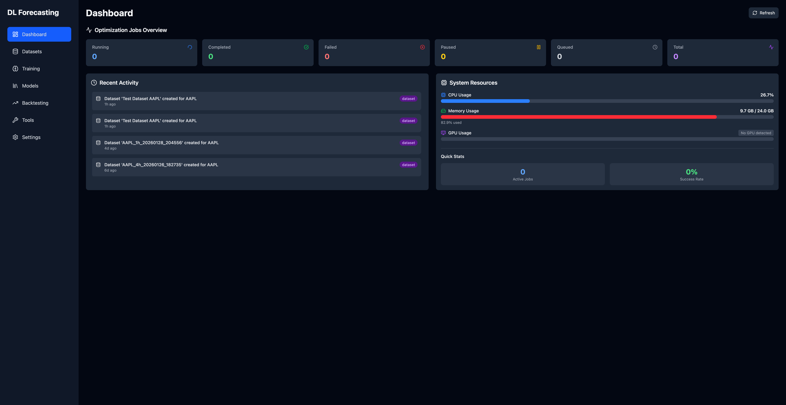
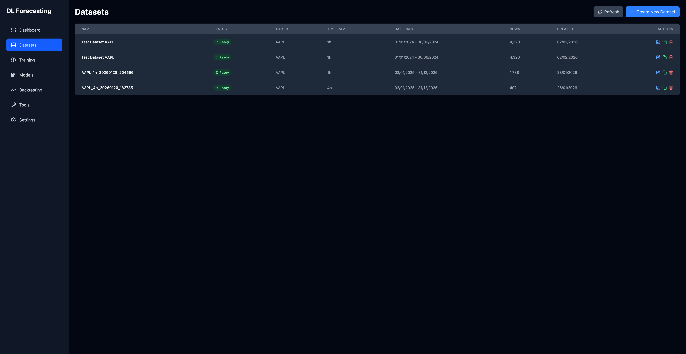
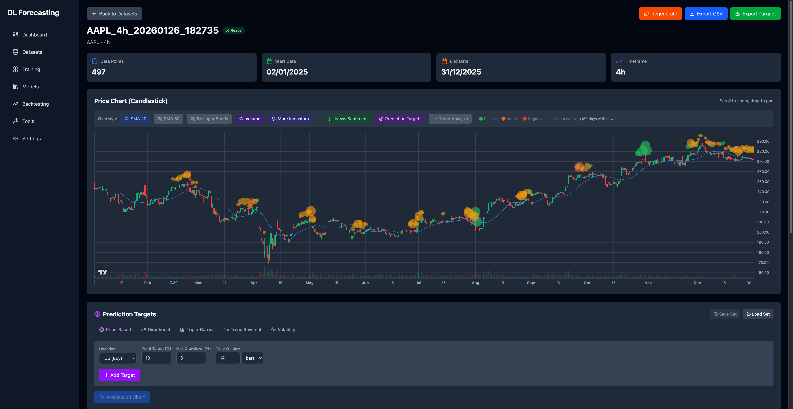
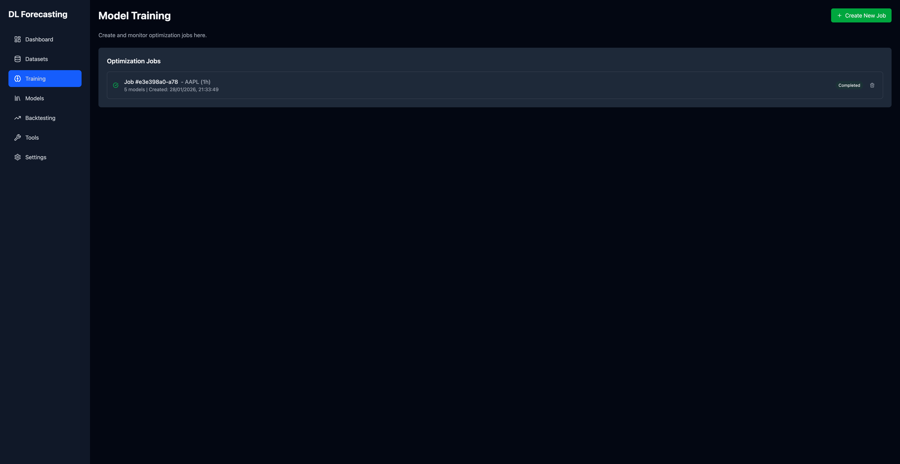
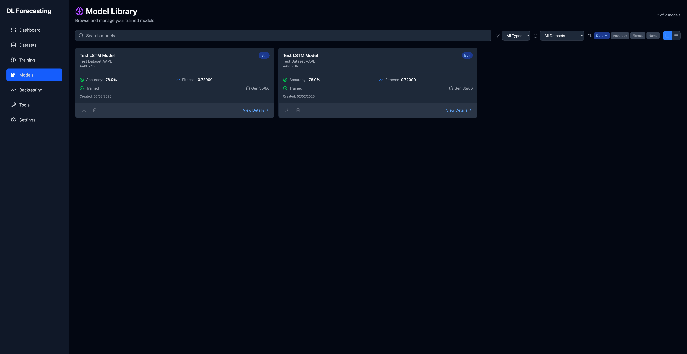
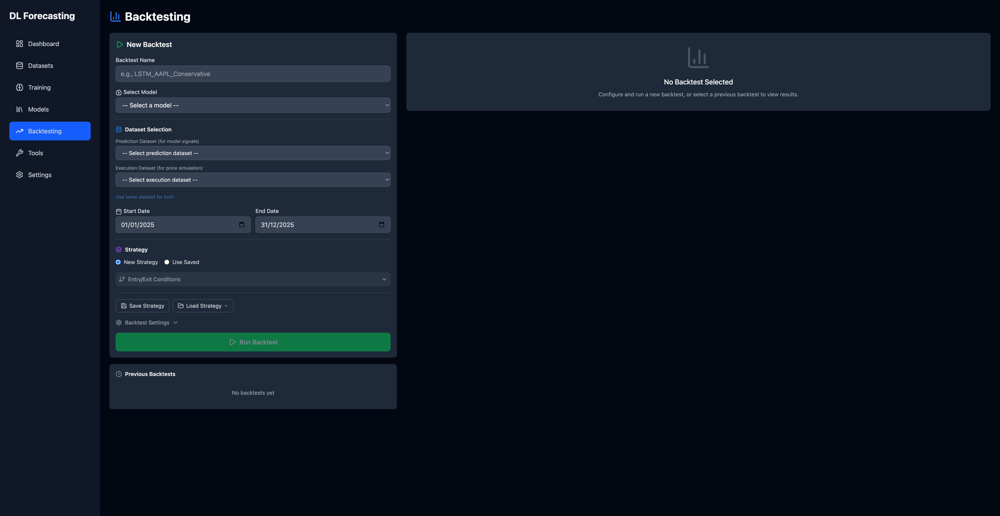
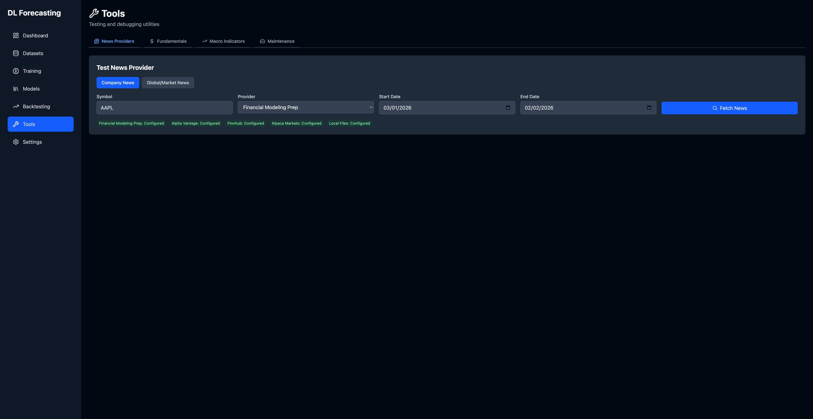

# BA2ML - Deep Learning Financial Forecasting Platform

A comprehensive platform for training and evaluating deep learning models for financial forecasting using genetic optimization and strategy backtesting.



## Overview

This platform provides three main components:

1. **Dataset Builder** - Fetch and prepare financial data with technical indicators, sentiment, and fundamentals
2. **Model Trainer** - Uses genetic optimization to build best-fit deep learning models for financial time series prediction
3. **Strategy Backtester** - Build and test trading strategies with visual condition builders and comprehensive analytics

## Screenshots

### Dashboard
Overview of optimization jobs, recent activity, and quick access to all features.


### Dataset Management
Create and manage datasets with multi-source data integration.



### Dataset Details & Charting
Interactive TradingView-style charts with technical indicators, prediction targets configuration, and data exploration.



### Model Training
Configure and monitor genetic optimization jobs with real-time progress tracking.



### Model Library
Browse trained models, view performance metrics, confusion matrices, and run predictions.



### Strategy Backtesting
Build complex trading strategies with visual condition builders and analyze performance.



### Tools
Utility tools for data management, indicator calculation, and exports.



## Features

### Dataset Preparation
- **Multi-provider data fetching**: Yahoo Finance, Alpha Vantage, Polygon.io, EODHD
- **Multiple timeframes**: 1m, 5m, 15m, 1h, 4h, daily
- **50+ technical indicators**: RSI, MACD, Bollinger Bands, ATR, ZigZag, and more
- **Fundamental data integration**: Earnings, financials via Financial Modeling Prep
- **Macro-economic data**: FRED integration for economic indicators
- **News sentiment analysis**: Multi-source sentiment with ML models
- **Interactive visualization**: TradingView-style charts with indicator overlays
- **Prediction targets**: Configurable directional, trend-based, and custom targets

### Model Training
- **11+ Deep Learning Architectures**:
  - **LSTM** - Long Short-Term Memory
  - **GRU** - Gated Recurrent Unit
  - **TCN** - Temporal Convolutional Network
  - **InceptionTime** - Inception-based time series
  - **ResNet** - Residual networks for time series
  - **XceptionTime** - Xception for time series
  - **OmniScale CNN** - Multi-scale convolutional
  - **MiniRocket** - Fast random convolutional kernels
  - **PatchTST** - Patch-based Transformer
  - **TST** - Time Series Transformer
  - **LSTM-FCN** - LSTM with Fully Convolutional
  - **N-BEATS** - Neural Basis Expansion

- **Genetic Algorithm Optimization**:
  - Population-based hyperparameter search
  - Elitism preservation
  - Crossover and mutation operators
  - Early stopping with configurable patience
  - Real-time progress monitoring

- **Training Features**:
  - Multiple prediction modes (shift, multistep)
  - Multiple loss functions (focal, cross-entropy, weighted)
  - Threshold optimization
  - Sequence length optimization
  - GPU-accelerated training with PyTorch
  - Checkpoint saving and recovery

### Model Management
- **Model Inventory**: Save, browse, and manage trained models
- **Performance Metrics**: Accuracy, precision, recall, F1, AUC-ROC, MCC
- **Confusion Matrix**: Visual classification performance analysis
- **Training History**: Epoch-by-epoch loss and metric curves
- **View Predictions**: Run inference on datasets and visualize results
- **Model Export**: Export models for deployment
- **Retrain**: Continue training existing models

### Strategy Backtesting
- **Visual Condition Builder**:
  - AND/OR logic groups
  - Model prediction conditions
  - Price and position conditions
  - Time-based conditions
  - Nested condition trees

- **Entry/Exit Conditions**:
  - Multiple condition types
  - Confirmation bars
  - Optimization ranges per condition

- **Risk Management**:
  - Take profit / Stop loss (fixed or %)
  - Trailing stops
  - Position sizing (fixed, percent, Kelly)
  - Max positions limit

- **Performance Analytics**:
  - Sharpe ratio, max drawdown, win rate
  - Profit factor, average trade duration
  - Equity curves and drawdown charts
  - Trade-by-trade analysis

- **Dual Dataset Support**:
  - Separate prediction dataset (e.g., 1h for signals)
  - Separate execution dataset (e.g., 1m for precise entries)

## Quick Start

### 1. Backend Setup

```bash
cd backend
python -m venv venv
source venv/bin/activate  # Windows: venv\Scripts\activate
```

#### GPU/CUDA Support (Recommended)

For GPU-accelerated training, install PyTorch with CUDA support **before** installing other requirements:

```bash
# Example for CUDA 12.4 (check pytorch.org for your CUDA version)
pip install torch torchvision torchaudio --index-url https://download.pytorch.org/whl/cu124
```

Then install the remaining dependencies:
```bash
pip install -r requirements.txt
```

#### CPU Only

If you don't have a CUDA-capable GPU:
```bash
pip install -r requirements.txt
```

### 2. Configure API Keys (Optional)

Copy and edit the environment file:
```bash
cp .env.example .env
```

API keys for enhanced data:
- `FMP_API_KEY` - Financial Modeling Prep (fundamentals)
- `FRED_API_KEY` - FRED (macro data)
- `NEWS_API_KEY` - News sentiment

### 3. Initialize Database

For a fresh installation:
```bash
cd backend
./venv/bin/python -c "from app.models.database import init_db; init_db()"
```

For an existing database, run migrations to apply schema updates:
```bash
cd backend
./venv/bin/python scripts/migrate_db.py
```

Check migration status:
```bash
./venv/bin/python scripts/migrate_db.py --status
```

### 4. Start Backend

```bash
cd backend
./venv/bin/python -m uvicorn app.main:app --reload --port 8000
```

Backend available at: http://localhost:8000
API docs: http://localhost:8000/docs

### 5. Start Frontend

```bash
cd frontend
npm install
npm run dev
```

Frontend available at: http://localhost:5173

## Project Structure

```
BA2MLTestPlatform/
├── backend/                 # FastAPI backend
│   ├── app/
│   │   ├── api/            # REST API endpoints
│   │   ├── models/         # SQLAlchemy database models
│   │   └── services/       # Business logic (training, backtesting)
│   ├── dataproviders/      # Data source integrations
│   ├── datasets/           # Cached datasets and models
│   └── tests/              # Backend tests
│
├── frontend/               # React + TypeScript frontend
│   ├── src/
│   │   ├── components/     # Reusable UI components
│   │   └── pages/          # Main application pages
│   └── public/
│
├── docs/                   # Documentation
│   ├── screenshots/        # Application screenshots
│   ├── plans/              # Implementation plans
│   └── spec/               # Specifications
│
└── scripts/                # Utility scripts
```

## Technology Stack

### Backend
- **FastAPI** - Modern Python web framework
- **SQLAlchemy** - Database ORM with SQLite
- **PyTorch** - Deep learning framework
- **tsai** - Time series deep learning library
- **Darts** - Forecasting library
- **pandas** - Data manipulation
- **TA-Lib** - Technical analysis indicators
- **backtesting.py** - Strategy backtesting

### Frontend
- **React 18** - UI framework
- **TypeScript** - Type-safe JavaScript
- **Vite** - Fast build tool
- **Tailwind CSS** - Utility-first styling
- **Recharts** - Charting library
- **Lucide** - Icon library
- **React Router** - Navigation

## API Documentation

The backend provides a comprehensive REST API:

### Datasets
- `GET /api/datasets` - List all datasets
- `POST /api/datasets` - Create a new dataset
- `GET /api/datasets/{id}` - Get dataset details
- `POST /api/datasets/{id}/regenerate` - Regenerate dataset

### Training Jobs
- `GET /api/jobs` - List all training jobs
- `POST /api/jobs` - Create a new training job
- `GET /api/jobs/{id}` - Get job status and progress
- `POST /api/jobs/{id}/elite-models/{rank}/save-to-inventory` - Save trained model

### Models
- `GET /api/models` - List all trained models
- `GET /api/models/{id}` - Get model details
- `POST /api/models/{id}/run-predictions` - Run inference on dataset
- `GET /api/models/{id}/confusion-matrix` - Get confusion matrix

### Strategies
- `GET /api/strategies` - List saved strategies
- `POST /api/strategies` - Create a new strategy
- `GET /api/strategies/compatible/{model_id}` - Find compatible strategies

### Backtests
- `GET /api/backtests` - List all backtests
- `POST /api/backtests` - Run a new backtest
- `GET /api/backtests/{id}` - Get backtest results

Full interactive API documentation available at http://localhost:8000/docs

## Testing

Run backend tests:
```bash
cd backend
./venv/bin/python -m pytest tests/ -v
```

## Contributing

1. Fork the repository
2. Create a feature branch (`git checkout -b feature/amazing-feature`)
3. Commit your changes (`git commit -m 'Add amazing feature'`)
4. Push to the branch (`git push origin feature/amazing-feature`)
5. Open a Pull Request

## License

For educational and research purposes.

## Acknowledgments

- [tsai](https://github.com/timeseriesAI/tsai) - State-of-the-art time series deep learning
- [Darts](https://github.com/unit8co/darts) - Forecasting library
- [backtesting.py](https://github.com/kernc/backtesting.py) - Backtesting framework
- [yfinance](https://github.com/ranaroussi/yfinance) - Yahoo Finance data
- [TA-Lib](https://github.com/mrjbq7/ta-lib) - Technical analysis library

## Install / first run

Two virtualenvs are used:

- **`backend/venv`** — the FastAPI backend + scripts. Always use
  `./venv/bin/python` (see `backend/CLAUDE.md`):
  ```bash
  cd backend
  ./venv/bin/pip install -e ../../BA2TradeCommon -e ../../BA2TradeProviders -e ../../BA2TradeExperts
  ./venv/bin/pip install -r requirements.txt
  ./venv/bin/python -m uvicorn app.main:app --reload
  ```
- **`~/ba2-venvs/test`** — the headless `ba2-test` CLI (`ba2test_launcher.py`):
  ```bash
  ~/ba2-venvs/test/bin/python ba2test_launcher.py --help
  ```

On startup the backend creates its data dirs under `BA2_HOME` (see below), not
inside the repo.

## Data & cache layout

Nothing is cached inside the repo anymore. All artifacts live under a single
root, **`BA2_HOME`** (env-overridable, default `~/Documents/ba2`):

```
BA2_HOME  (default ~/Documents/ba2)
├── common/                 # shared with the live trader
│   ├── cache/              # raw provider cache: OHLCV parquet, as_of cache, fmp_history   (CACHE_FOLDER)
│   ├── db.sqlite           # shared app-settings / API-keys DB (FMP, Finnhub, ...)         (DB_FILE)
│   └── options/            # options-history cache
├── test/                   # THIS app's artifacts (were inside backend/ — the bug)
│   ├── datasets/           # generated dataset CSVs
│   ├── trained_models/     # saved model artifacts
│   ├── cache/jobs/         # per-job cache
│   ├── cache/news/         # news content files
│   └── news_exports/       # exported news JSON
└── trade/
    └── screener/           # metric_store/ (parquet) + screener_history.sqlite
```

Paths are centralized in `backend/app/paths.py` (test bucket) and
`ba2_common/config.py` (common/trade buckets). Each is env-overridable:

- `BA2_HOME` relocates everything.
- `CACHE_FOLDER`, `DB_FILE`, and the per-dir vars
  `BA2_DATASETS_DIR` / `BA2_MODELS_DIR` / `BA2_JOBS_CACHE_DIR` /
  `BA2_NEWS_CACHE_DIR` / `BA2_NEWS_EXPORTS_DIR` still win when set
  (backward-compatible).

### Migrating from the old layout

The old layout cached under `~/Documents/ba2_trade_platform` and inside
`backend/`. Migrate with:

```bash
# dry-run: prints the planned moves + sizes (default)
backend/venv/bin/python scripts/migrate_cache_layout.py
# perform the moves
backend/venv/bin/python scripts/migrate_cache_layout.py --apply
```

The script is idempotent (skips missing sources / non-empty destinations) and
never deletes a source if its move fails. **Restart any running instances after
migrating** so they pick up the new locations (the shared app-settings DB with
your API keys moves to `common/db.sqlite`).
