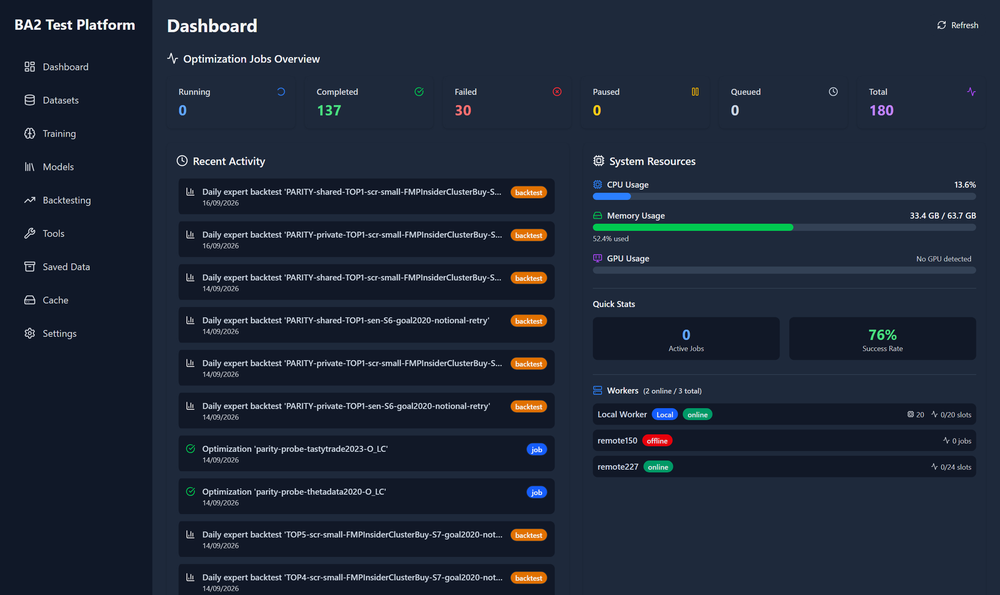
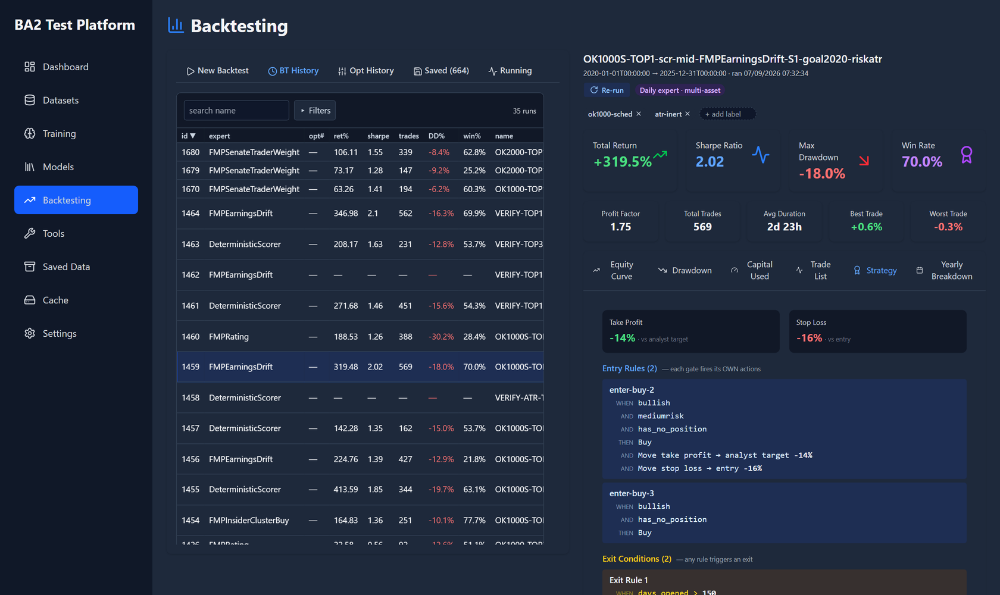
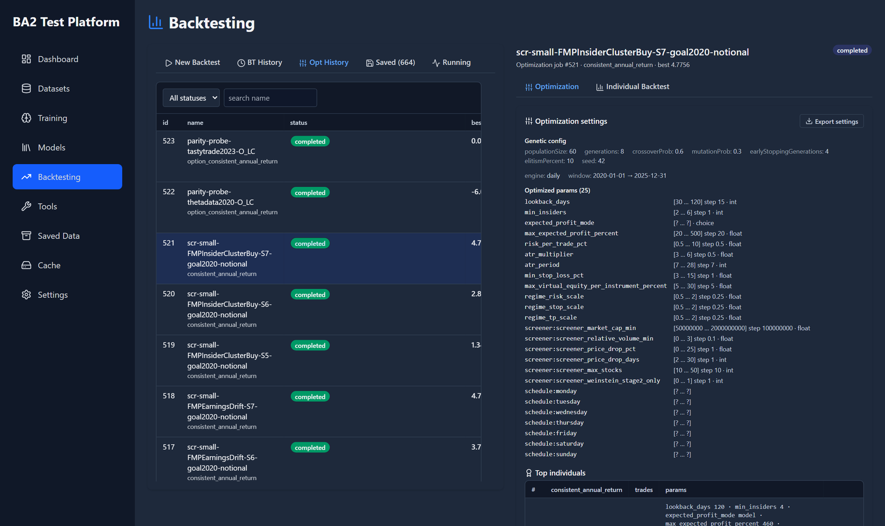
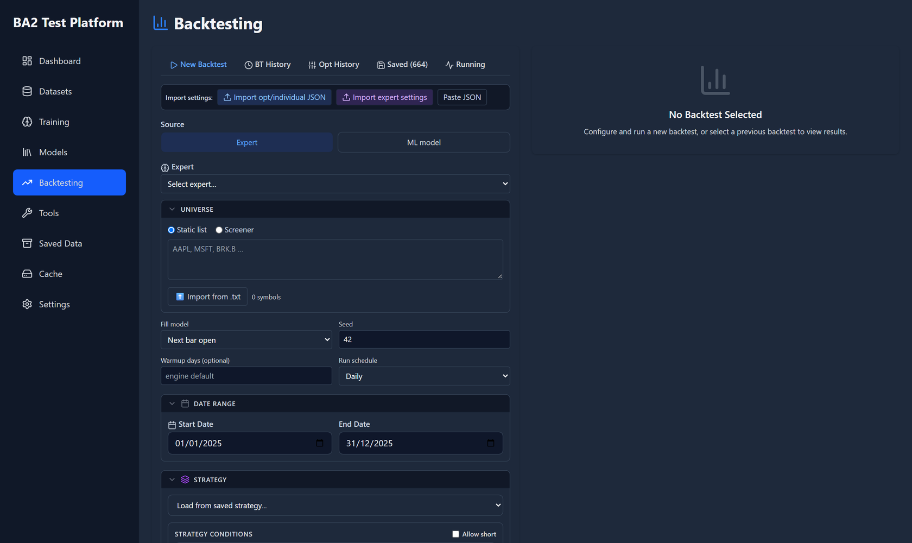
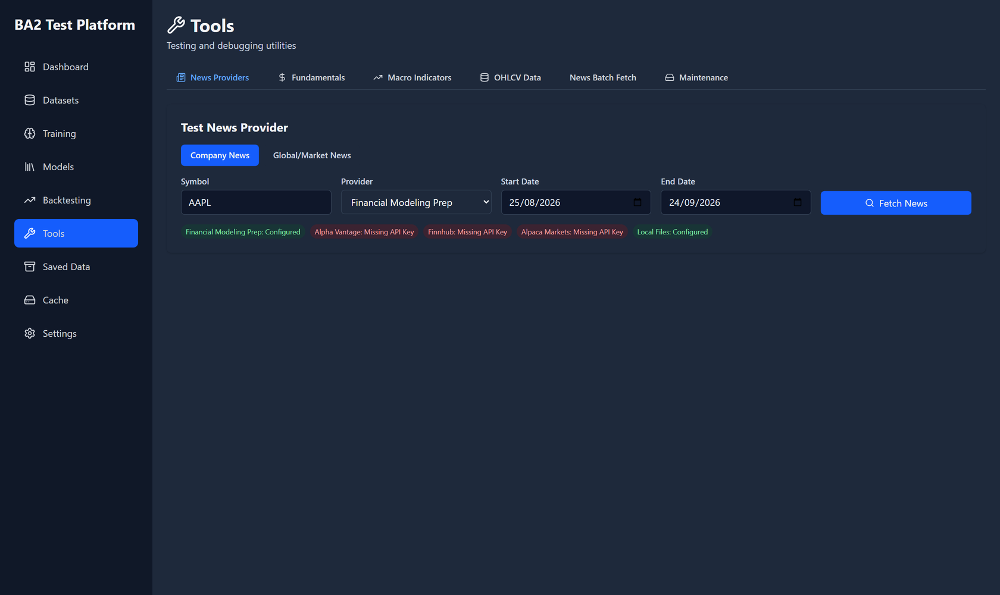
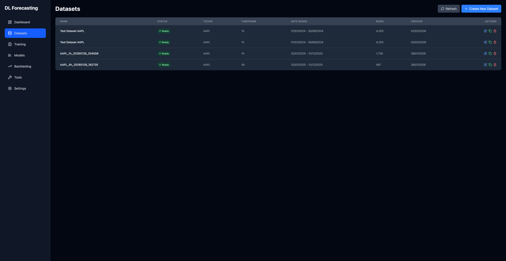

# BA2 Test Platform (`ba2-test`)

The backtesting and genetic-optimization platform for the
[BA2 Trade Platform](../README.md)'s market experts. It replays the same expert and
risk-manager code the live platform runs, day by day over historical data. It then searches
expert settings, rulesets and exit parameters with a genetic algorithm, stress-tests the
winners, and hands them back to the live platform for deployment. A FastAPI backend with a
React/Vite UI, a `ba2-test` console command, and optional remote workers that share the GA load.



## Quick start

From the monorepo root:

```bash
./install.sh --test-only --editable      # Windows: .\install.ps1 -TestOnly -Editable
source ~/ba2-venvs/test/bin/activate     # Windows: ~\ba2-venvs\test\Scripts\Activate.ps1
ba2-test serve                           # API on :8000, UI on :5173
```

Open http://localhost:5173 and enter provider API keys (FMP at least) under
**Settings -> API Keys**. Then run a backtest or a GA job from the CLI:

```bash
ba2-test backtest --expert FMPRating --universe AAPL,MSFT,NVDA --start 2024-01-01 --end 2024-12-31 --save
ba2-test optimize --expert FMPRating --strategy S2 --universe AAPL,MSFT,NVDA --start 2023-01-01 --end 2024-12-31
```

`start.bat` / `start.sh` wrap `ba2-test serve`. [QUICK_START.md](QUICK_START.md) has the longer
walkthrough; [Install and first run](#install-and-first-run) and
[Command-line tools](#command-line-tools) have the details.

## How it relates to the trade platform

Both apps live in one monorepo and share three installable packages:

| Package | Import | Provides |
|---|---|---|
| `packages/common` (`ba2trade-common`) | `ba2_common` | models, types, interfaces, rulesets/TradeConditions, risk manager, market calendar, market-condition profiles, BA2 paths config |
| `packages/providers` (`ba2trade-providers`) | `ba2_providers` | market data providers (OHLCV, FMP history, news, FRED, option history vendors) |
| `packages/experts` (`ba2trade-experts`) | `ba2_experts` | the non-LLM experts (FMPRating, FMPEarningsDrift, FactorRanker, ...) |

The backtest engine imports these packages directly. A strategy's fitness is therefore
computed by the same expert, ruleset and risk-manager code that trades live. The two apps keep
separate DBs (see [Data and cache layout](#data-and-cache-layout)) but share the raw provider
cache.

## Screenshots

### Dashboard
Optimization job counts by status, recent activity, system resources and the worker fleet.


### Backtest results
A daily expert backtest over 2020–2025: headline metrics, and tabs for the equity curve,
drawdown, capital used, trade list, strategy and yearly breakdown. The history list on the left
filters, sorts and pages through every run.


### Strategy view
The entry rules and exit conditions a backtest ran with, rendered the way the live platform
shows them.



### Optimization jobs
A GA optimization job: its genetic config, the parameter ranges it searched (expert settings,
risk manager, screener and schedule genes) and its top individuals.



### New backtest
Pick an expert (or an ML model), a static or screener universe, the fill model, schedule, dates
and strategy; or import settings from an optimization individual or a live expert.



### Tools
Provider testers (news, fundamentals, macro), the OHLCV cache tool, news batch fetch and
maintenance.



### Deep-learning module
Datasets, dataset charting, model training and the model library (screenshots from an earlier
release).




## Pages

Routes are defined in `frontend/src/App.tsx`. The sidebar is in `components/layout/Sidebar.tsx`.

| Page | Route | What it does |
|---|---|---|
| Dashboard | `/` | job counts by status, recent activity, and the worker fleet (online/total, busy slots) |
| Backtesting | `/backtesting` | the main workspace, described in the next section |
| Datasets | `/datasets`, `/datasets/:id` | DL module: build and chart datasets, prediction targets |
| Training | `/training`, `/training/:id` | DL module: GA model-training jobs, logs, generations |
| Models | `/models`, `/models/:id` | DL module: trained-model library, metrics, confusion matrix, predictions |
| Tools | `/tools` | news, fundamentals and macro (FRED) provider testers, OHLCV cache tool, news batch fetch, maintenance |
| Saved Data | `/saved-data` | saved backtest strategies and indicator collections |
| Cache | `/cache` | disk usage per cache type, clearing, data builds (OHLCV, screener metrics, option chains, pre-warm), option chain viewer |
| Settings | `/settings` | provider API keys (with a copy-from-trade-platform action), app settings, remote workers (add, health check, push cache, update, import/export) |

The Backtesting page has these tabs: **New Backtest**, **BT History** (paginated, with
label filters), **Opt History** (optimization jobs and their TOP-N individuals), **Saved**,
and **Running** (the live job queue). A selected backtest shows its equity curve,
drawdown, capital used, trade list (with per-trade charts and option trade details),
strategy (resolved ruleset) and yearly breakdown.

## Backtesting and optimization

### Daily expert backtests
The `daily_expert` engine runs one expert over a multi-symbol universe on a daily or intraday
fill clock (`--interval`, e.g. `5min`, for intraday TP/SL). It uses as-of data only.
Supported experts are listed in `_SUPPORTED_EXPERTS` in
`backend/app/services/backtest/daily_backtest_handler.py`. Today they are FMPRating,
FMPEarningsDrift, FMPEarningsEvent, FMPInsiderClusterBuy, FMPSenateTraderWeight,
FMPSenateTraderCopy, FinnHubRating, FactorRanker, DeterministicScorer, ETFTrend and
PullbackReversion (research-only, backtest-registered).
Classic-RM experts use enter/exit rulesets. Bypass experts such as FactorRanker rebalance to
target weights. The Smart (agentic) risk manager is not modelled, and a run that asks for it is
refused.

A run is configured with:
- the expert and its settings (the form is built from the expert's own settings definitions)
- the universe: a symbol list, or a point-in-time **screener** fed by a prebuilt parquet
  metric store (market cap, price, volume and price-drop filters; each can get a GA range)
- the entry schedule (weekday and time), warm-up, capital, commission, slippage and spread
- the enter/exit **rulesets**, built in the condition builder or taken from exit presets

After a run you can rerun it in place, run a what-if with selected trades excluded (the curves
are recomputed without re-running), compare runs, export them, and label them.

### Genetic optimization
An optimization job evolves one population over expert settings, risk-manager and TP/SL
parameters, ruleset condition toggles and thresholds, screener ranges, and the entry weekday.
Each job records its generation history and persists its best **TOP-N individuals** as
backtests. Any individual can be re-run as a backtest from Opt History, and a job can
warm-start from an earlier job's population.

The fitness metrics come from `GET /api/optimization/fitness-options` (`services/strategy_fitness.py`).
They include Sharpe, Sortino, Calmar, return, profit factor, SQN, max drawdown, consistent
annual return (CAR), and option-specific CAR variants. Optional knobs are per-trade profit caps,
a trade-count scale, a win-rate factor, and a robustness-adjusted fitness. The
robustness-adjusted fitness is on by default. See
[docs/grid-and-fitness-guide.md](docs/grid-and-fitness-guide.md).

### Robustness tests
Launch these from a saved backtest (`POST /api/backtests/robustness`). **Monte Carlo** resamples
the persisted trades in under a second, without a re-run, and reports percentile bands and a
drop-K table. **Schedule perturbation** re-runs the backtest once per variant entry weekday or
time shift. See [docs/robustness-suite.md](docs/robustness-suite.md).

### Options backtests
A strategy whose rules name an option action becomes an options run. Built-in structures
include long call, bear-put vertical, iron condor, jade lizard, butterfly, ratio spread and
covered call; unbounded-risk structures are refused. You choose one of three option history
stores, and each one's history floor is enforced:

| Store | Vendor | Floor |
|---|---|---|
| `sqlite` (default) | Alpaca | 2024-01-18 |
| `tastytrade` (alias `parquet`) | dxfeed | 2022-10 |
| `thetadata` | ThetaData | set by the provider |

Build the Alpaca cache with `ba2-test fetch-options`. Build the parquet stores with
`tools/warm_options_history.py --provider tastytrade|thetadata` (repo root). Underlying prices
come from the OHLCV cache.

### Market-condition genes (options)
`--market-condition-profile` adds entry gates from registered profiles in
`ba2_common.core.market_conditions`, such as `ohlcv-v1` and `ta-structure-v1`, to every option
structure's entry tree. The genes decide whether each gate is off, above or below, and set its
threshold. A profile requires a prepared snapshot (`--market-condition-manifest`) built with
`tools/warm_market_conditions.py`, so that every worker reads identical indicator values.
Profiles are off by default.

### Rulesets and the live platform
- Import and export a strategy's rules as JSON: `POST /api/strategies/import-rules` and
  `GET /api/strategies/{id}/export-rules`. The UI does this through `RuleIO`.
- Convert a live-platform ruleset export file: `POST /api/ruleset/convert-live`.
- With `BA2_LIVE_DB` pointing at the live DB, an expert's live rulesets can be read
  **read-only** (`GET /api/experts/{id}/open-positions-ruleset` and `.../enter-market-ruleset`).
- To deploy a backtest into a live ExpertInstance, use `tools/export_deploy_payload.py` (reads
  the test DB) and then `tools/import_deploy_payload.py` (writes the live DB). Both are at the
  repo root.

## Distributed workers

The master (the serve process) pushes GA trials to remote worker servers over HTTP. Each trial
is hermetic and seeded, so its fitness does not depend on which host ran it.

- **Worker**: run `ba2-test worker --port 8100 --password <secret> [--workers N]` on the worker
  host (`app/worker_server.py`). It needs no DB, runs trials in its own process pool, and
  requires a bearer password on every call. It defaults to CPU count - 1 slots. To provision a
  Debian host as a systemd service, see [deploy/README.md](deploy/README.md).
- **Master**: add each worker (name, URL, password) on **Settings -> Workers**, then pass
  `--worker NAME` (repeatable) or `--workers A,B` to `ba2-test optimize` or `optimize-batch`.
- **Pre-flight** (`services/distributed_eval.py`): for each selected worker, the master calls
  `ensure_synced` (`services/worker_client.py`). This compares the worker's `TEST_APP_VERSION`
  with the master's and triggers `/update` (git pull, package reinstall, restart) on a
  mismatch. The master then pushes missing cache files as a tar stream, and prepares the
  market-condition snapshot if the run pins one. A worker that fails pre-flight is dropped.
  The master re-checks dropped workers during the run and re-admits any that recover.
- **During a run**: the master's local consumer threads and the remote dispatcher threads all
  claim trials from one per-job queue (`services/trial_broker.py`), so no trial runs twice. A
  failed trial is requeued.
- Result rows are replicated to workers with sync enabled (`services/sync_client.py`), so a
  worker host can browse past runs.

## Deep-learning forecasting module

This module is the original feature set, and it is still in the app (Datasets, Training and
Models pages; `/api/datasets`, `/api/jobs`, `/api/models`, `/api/ml`). It builds datasets
with indicators, fundamentals, macro and news sentiment. It trains tsai and Darts models
(LSTM, GRU, TCN, InceptionTime, ResNet, XceptionTime, OmniScaleCNN, MiniRocket, PatchTST, TST,
N-BEATS) with a GA hyperparameter search, and keeps a model library. The ML backtest engine
(`engine_type` `ml`) runs model-driven strategies. The backtest workflow above does not depend
on this module.

## Install and first run

From the monorepo root, build the test venv. It installs the `common -> providers -> experts`
chain, `backend/requirements.txt`, the `ba2-test` command, and the frontend `npm install`,
then migrates the test DB:

```bash
./install.sh --test-only --editable          # Linux/macOS -> ~/ba2-venvs/test
.\install.ps1 -TestOnly -Editable            # Windows
```

Then start the app:

```bash
ba2-test serve                 # API on :8000 + Vite UI on :5173
ba2-test serve --mode back     # API only (add --reload for development)
```

`start.bat` / `start.sh` in this folder are thin wrappers around the same command
(`start.bat backend|frontend|all [serve flags]`); they find `ba2-test` on `PATH` or in the
installer's default `~/ba2-venvs/test`.

- UI: http://localhost:5173. API: http://localhost:8000. OpenAPI docs: http://localhost:8000/docs.
- The frontend reads `VITE_API_BASE` (default `http://localhost:8000/api`, see
  `frontend/src/lib/config.ts`).
- On startup the backend creates its tables and runs `backend/scripts/migrate_db.py`.
- Set provider API keys (FMP, Alpaca, Finnhub, ...) in **Settings -> API Keys**, or copy them from
  the trade platform's DB. The FRED providers read the AppSetting `fred_api_key` (lower case);
  the page lists `FRED_API_KEY`, but AppSetting lookups are exact, and upper-case `FRED_API_KEY`
  is only read as an ENV var (by `ba2-test prewarm` and a few test-platform services). See
  [../docs/REPRODUCE-BACKTESTS.md](../docs/REPRODUCE-BACKTESTS.md) for which keys reproducing
  results needs.
- Set `BA2_ADMIN_TOKEN` to enable the token-protected admin endpoints (`/api/admin/*`:
  version, update, logs, DB cleanup).

## Command-line tools

**`ba2-test`** (`ba2test_launcher.py`) runs in-process against `backend/`. Run
`ba2-test <cmd> -h` for per-command help.

| Command | Purpose |
|---|---|
| `serve` | start the API and/or UI |
| `backtest ...` | run one daily expert backtest; arguments pass through to `run_daily_backtest` (`--track`/`--save` to persist) |
| `optimize` | one GA job (`--expert --strategy --universe --start --end --fitness ...`); `--submit` queues it on the running serve |
| `optimize-batch` | run several experts and strategies one after another; each job's TOP-N is persisted |
| `worker`, `sync-cache` | run a worker server; push the cache to a configured worker |
| `fetch-cache`, `prewarm` | fill the as-of OHLCV cache; pre-build per-expert FMP history caches |
| `build-screener-metrics`, `recompute-screener-drops` | build or refresh the screener metric store |
| `fetch-options` | build the Alpaca options-history cache |
| `cache-usage`, `cache-clear` | inspect or clear the cache |
| `runs list/save/delete/clear-unsaved/prune/stats`, `report` | manage tracked runs; write an HTML summary |
| `replay ...` | replay a recorded live-session bundle offline (inventory, experts, gather, historical, warm-plan, warm) |

**`ba2cli.py`** is a thin HTTP client for the REST API, used for scripting and LLM agents.
Its global options are `--host <server> --port 8000 [--token $BA2_ADMIN_TOKEN] [--human]`. It
has resources for datasets, targets, indicators, jobs, profiles, models, strategies,
backtests, cache, workers, tasks, settings, server, ml, dashboard, logs and help. Run
`python ba2cli.py help` for the manual.

## API overview

All routers are mounted in `backend/app/main.py`. The full reference is at `/docs`.

| Prefix | Area |
|---|---|
| `/api/backtests` | run (`/daily`), list, rerun, what-if, yearly, trade chart, compare, export, save, robustness, screener stores |
| `/api/strategies` | strategies, optimizations (`/optimizations`, `/running`, `/{id}/export`, individual -> backtest), `/{id}/optimize`, `/optimize-batch`, rule import/export |
| `/api/optimization/fitness-options` | fitness metric catalog and knob defaults |
| `/api/experts` | backtestable experts and their settings definitions; live-ruleset read (`BA2_LIVE_DB`) |
| `/api/ruleset` | condition/action vocabulary, exit presets, live-export conversion |
| `/api/workers` | worker CRUD, status, health check, sync-cache, update, import/export |
| `/api/cache`, `/api/data` | cache usage/clear, option chain browsing; data builds (OHLCV, screener metrics, options, prewarm) |
| `/api/tasks`, `/api/dashboard`, `/api/ws/...` | task queue, dashboard stats, job WebSockets |
| `/api/settings`, `/api/admin` | settings and API keys; version, update, logs, DB cleanup (token) |
| `/api/datasets`, `/api/jobs`, `/api/models`, `/api/ml`, `/api/target-sets`, `/api/indicator-collections`, `/api/tools` | DL module and data tools |

## Data and cache layout

The repo holds no data. Everything lives under **`BA2_HOME`** (default `~/Documents/ba2`,
defined in `packages/common/ba2_common/config.py`):

```
BA2_HOME
├── common/cache/          # shared with the live platform            (CACHE_FOLDER)
│   ├── <Provider>/, ohlcv/, fmp_history/, fred/, news/
│   ├── screener/          # metric_store/ (parquet) + screener_history.sqlite
│   ├── options/           # Alpaca options_history.sqlite
│   ├── TastyTradeOptionsProvider/, ThetaDataOptionsProvider/   # option parquet stores
│   └── market_conditions/, replay/
├── test/                  # this app's data
│   ├── dl_forecasting.db  # the single test DB: app data + appsetting keys (DATABASE_URL)
│   ├── datasets/, trained_models/, cache/jobs/, cache/news/, news_exports/
│   └── logs/              # (LOG_FOLDER)
└── trade/                 # live trade platform DB(s)
```

`BA2_HOME` relocates everything. The per-path overrides are `CACHE_FOLDER`, `DATABASE_URL`,
`LOG_FOLDER`, `BA2_DATASETS_DIR`, `BA2_MODELS_DIR`, `BA2_JOBS_CACHE_DIR`,
`BA2_NEWS_CACHE_DIR` and `BA2_NEWS_EXPORTS_DIR` (`backend/app/paths.py`). To migrate the
pre-`BA2_HOME` layout, run `scripts/migrate_cache_layout.py`. It is a dry run by default;
pass `--apply` to move files, and restart running instances afterwards.

## Versioning

`version.py` holds `TEST_APP_VERSION` (`YYYY.MM.NNNNN`). Increment the build number before
every push that touches `testplatform/` **or `packages/`**. Changes confined to
`ba2_trade_platform/` bump `ba2_trade_platform/version.py` instead. Workers compare
`TEST_APP_VERSION` only, not the git commit. An unbumped shared-package change would leave
workers running different code while they report themselves as synced. Commit and push the
bump: the master refuses to sync workers to a version that a `git pull` cannot reach
(`self_update.unsyncable_reason`).

## Testing

```bash
# backend (from testplatform/backend; pytest.ini puts packages/* and testplatform/ on the path)
~/ba2-venvs/test/bin/python -m pytest tests            # Windows: ~/ba2-venvs/test/Scripts/python.exe
~/ba2-venvs/test/bin/python -m pytest tests -m "not slow"

# frontend (vitest)
cd frontend && npm test
```

The shared packages have their own suites (`packages/*/tests`). Run them separately.

## Project structure

```
testplatform/
├── ba2test_launcher.py   # `ba2-test` console command
├── ba2cli.py             # REST API client
├── version.py            # TEST_APP_VERSION
├── backend/
│   ├── app/api/          # FastAPI routers
│   ├── app/services/     # backtest engine (services/backtest/), GA, fitness, robustness,
│   │                     #   distributed eval + worker client, caches, DL training
│   ├── app/worker_server.py
│   ├── scripts/          # migrate_db.py, run_daily_backtest.py, ...
│   └── tests/
├── frontend/src/         # React 19 + TypeScript + Vite + Tailwind (pages/, components/, lib/)
├── deploy/               # worker host provisioning (systemd, fail2ban)
└── docs/                 # guides, plans, specs, screenshots
```

Useful docs: [grid & fitness guide](docs/grid-and-fitness-guide.md),
[robustness suite](docs/robustness-suite.md),
[daily expert backtest scope](docs/daily-expert-backtest-scope.md),
[exit ruleset UI](docs/exit-ruleset-ui-requirements.md), `docs/superpowers/` (backtest, options
and screener designs).

## License

Part of the BA2 Trade Platform monorepo and covered by its [license](../LICENSE): PolyForm
Noncommercial 1.0.0, with an added permission to run it on your own personal accounts.
Commercial use is not licensed.
